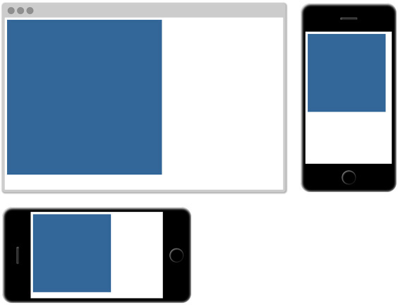

# Lab - Basic CSS

**Requirements:**

- Put all of your solutions in a HTML file.
- Your CSS code should be in a separate file.
- Each answer is in a `section` element and contains the question and solution
- Make your page look nicely.

## Assignments

1. Given this HTML structure:

   ```html
   <div id="assignment1">
     <h1 class="header">About Project Gutenberg</h1>
     <p id="para1">Project Gutenberg is an online library of free eBooks.</p>
     <p>
       Project Gutenberg was the first provider of free electronic books, or
       eBooks. Michael Hart, founder of Project Gutenberg, invented eBooks in
       1971 and his memory continues to inspire the creation of eBooks and
       related content today.
     </p>
     <h1 class="header">Project Gutenberg Mission Statement</h1>
     <p>To encourage the creation and distribution of eBooks.</p>
     <p>
       A 2004 essay by Michael Hart provides more detail on the mission
       statement, and some of the beliefs that guide Project Gutenberg’s
       activities in fulfillment of that mission.
     </p>
   </div>
   ```

   - Change the color of all `<p>` elements, example `#2c3e50`.
   - Change the color of the element with ID `para1`, example `#2ecc71`.
   - Change the color of class `header`, example `#e67e22`.
   - Change the background color of all `<h1>` elements, example `linen`.
   - Pick one pattern in [CSS3 Patterns](http://projects.verou.me/css3patterns/) and apply to the background of the page, example _Lined paper_.
   - With the font property: Set the <p> to "italic", "20px" and "Verdana".
   - Make the first letter of each paragraph 200% bigger and has different color, example `#27ae60`.
   - Hide the first `<h1>` element. It should still take up the same place as before. Hint: `visibility`.
   - Hide the first `<h1>` element. It should not take up any space. Hint: `display`.
   - Create 20% margin left and right of the text.

   Example:
   

2. Given this HTML structure:

   ```html
   <div id="assignment2">
     <a href="">Jump to the first assignment</a>
   </div>
   ```

   - Change the attribute `href` of the `<a>` element so that it will take to the first assignment part on the page when user click on it.
   - Design the `<a>` tag to have different style in four different states:
     - Default state
     - When user hover the mouse on it
     - When user click on it
     - After user click on it

3. Given this HTML structure:

   ```html
   <div id="assignment3">
     <ul>
       <li>
         Top level
         <ul>
           <li>
             Second level
             <ul>
               <li>
                 Third level
                 <ul>
                   <li>
                     Fourth level
                     <ul>
                       <li>Fifth level</li>
                     </ul>
                   </li>
                 </ul>
               </li>
             </ul>
           </li>
         </ul>
       </li>
     </ul>
   </div>
   ```

   - Set the `font-size` of this assignment to `16px`
   - Use just one declaration to make the text of lower level smaller the higher level.
   - How to make all levels to have the same font-size which is slightly smaller (80%) than the root font-size?
   - Discuss with your neighbors to understand the effect.
     

4. Create a square box element that will always display as a square a little smaller than the viewport: (resize the window browser to see the effect)
   
5.
