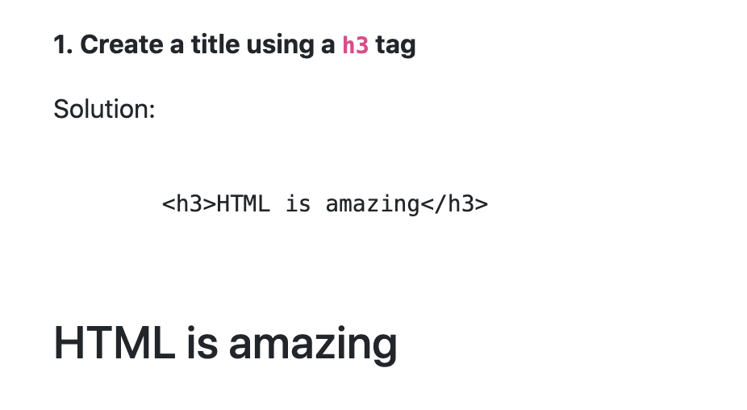

# Basic HTML

**Requirements:**

- Create a HTML document and put all of your answers there.
- Each answer is in a `section` element and contains the question and solution, for example:

```html
<section>
  <p>
    <strong>1. Create a title using a <code>h3</code> tag</strong>
  </p>
  <p>Solution:</p>
  <pre>
    <code>
      &lt;h3&gt;HTML is amazing&lt;/h3&gt;
    </code>
  </pre>
  <h3>HTML is amazing</h3>
</section>
```

- Make your document look nicely.



> Note: You can show HTML tags as plain text in HTML on a website or webpage by replacing `<` with `&lt;` or `&60;` and `>` with `&gt;` or `&62;` on each HTML tag that you want to be visible.

## Assignments

1. **HTML comment**: Comment the second paragraph of the following HTML document

```html
<h3>In this course we'll learn:</h3>
<p>HTML & CSS</p>
<p>Python</p>
<p>Javascript</p>
```

2. **Hyperlink 1**: Create a hyperlink that leads to `www.coderschool.vn`

3. **Hyperlink 2**: Create a hyperlink to take you to another part of the same HTML document

4. **Hyperlink 3**: Create a hyperlink that opens the linked document in a separate browser tab

5. **Article**: Create an article element that has a title and a paragraph (HTML5 article element represents independent item like a blog entry in an web document).

6. **Audio**: Embed an audio clip into a web page (Ref: https://htmlreference.io/element/audio/)

7. **Video**: Embed an video clip into a web page.

8. **Image**: Create an image with these attributes:

   - An alternate text
   - The size of the image is 250 pixels wide and 400 pixels tall.
   -

9. **Bold text**: How to write bold text using HTML tags?

10. **Underline text**: How to underline a text in a HTML document?

11. **Strikeout**: Add a line through a word in a paragraph.

12. **Line break**: Add a line break in middle of a paragraph.

13. **Horizontal line**: Add a horizontal line between two paragraphs.

14. **Unordered List**: Create an unordered list with three items.

15. **Ordered List**: Create three ordered lists that use numbers/uppercase ABC/roman numbers for the item. Each has 2 items.

16. **Definition list**: Create a definition list with two items. Each item has a description.

17. **Button**: Create a button that pop up a window says "Hi friend!" when click on it. Hint: `onclick`, `alert()`.

18. **Table**: Create a table with two rows, three columns, and headers.

19. **Navigation Links**: How to define a section with navigation links.

20. **Toggable Detail**: How to define a toggable block of content with a summary and additional details. (Ref: https://htmlreference.io/element/details/)

21. **Form**: Create a form that asks for:

    - Email, password and confirm password. Each of the field has a arcording placeholder.
    - Title (Radio box), 2 options: `Developer` or `Employer`
    - Interested in (Checkbox), 3 options: `ReactJS`, `NodeJS`, `Web Design`
    - City (Select box), 3 options: `Hanoi`, `HCMC`, `Da Nang`
    - Short Bio (Text area)
    - A confirm button which is disabled.
