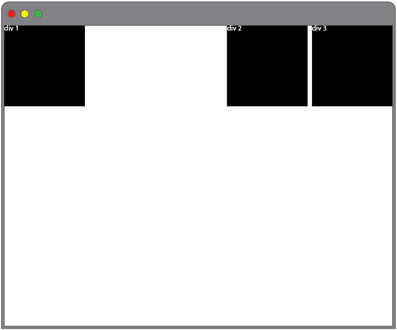
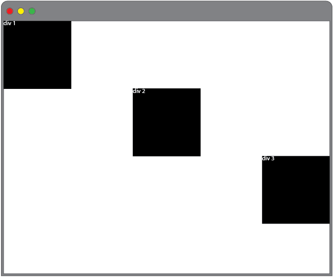
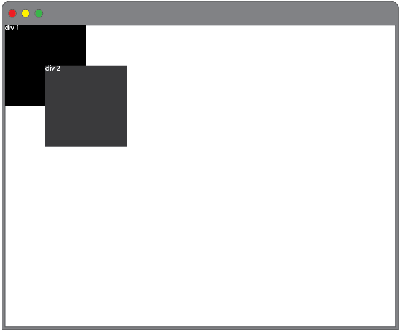
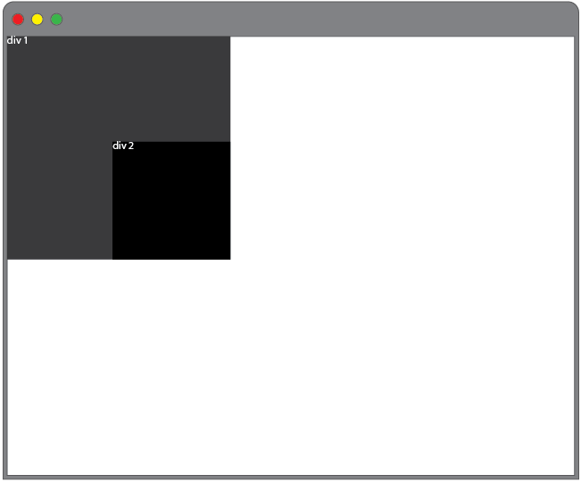
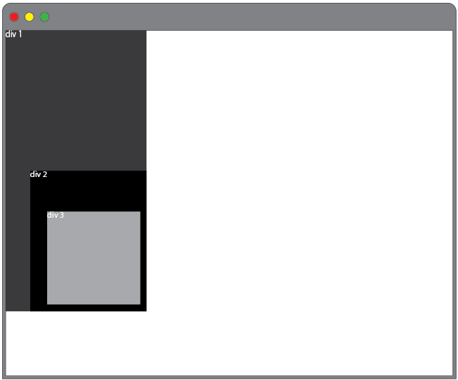
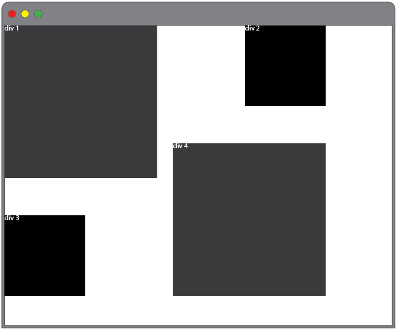

# Lab - CSS Layout Challenge

## Getting Started

In this exercise, we'll take a series of simple comps and recreate each. You will make the appropriate number of `<div>` tags with the div numbers indicated in the comps, give them a `<height>`, `<width>`, and `background-color` and then make them match the layout in the comp. Here's an example of what this might look like in your HTML and CSS:

Your HTML:

```HTML
<div class="div1">
  div1
</div>

<div class="div2">
  div2
</div>
```

Your CSS:

```CSS
div {
  width: 100px;
  height: 100px;
  background-color: black;
  color: white;
}
.div1 {
  float: right;
}

.div2 {
  float: left;
}
```

**Requirements:**

- Put all of your solutions in a HTML file.
- Your CSS code should be in a separate file.
- Each answer is in a `section` element and contains the question and solution
- Make your page look nicely.

## Challenges

### Challenge 1:



### Challenge 2:



### Challenge 3:


### Challenge 4:



### Challenge 5:


### Challenge 6:


### Challenge 7:



### Challenge 8:


### Challenge 9:


### Challenge 10:


### Challenge 11:



### Challenge 12:


### Challenge 13:


### Challenge 14:


### Challenge 15:


