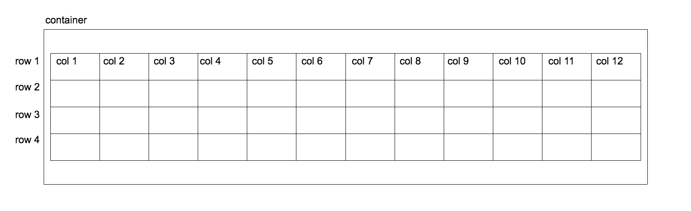

# Bootstrap 4

Bootstrap is a web development framework, originally invented at Twitter in 2011 by Mark Otto and Jacob Thornton. Now it's open source and has grown to be one of the most popular web development frameworks.

One of the most important feature is Bootstrap's **grid system**: a series of CSS classes and media queries that allow you to build responsive web design. Using the grid system is as easy as applying a few classes to your elements.

Bootstrap offers a large collection of fundamental UI components that allow you to quickly construct your web page. For example, Modal dialogs, progress bars, navigation bars, tooltips, carousel, dropdown menu, tabs, cards, forms.

## Get started

**Using CDN**

- Go to the [Boostrap's Documentation](https://getbootstrap.com/docs/4.0/getting-started/introduction/), put the **Starter template** in an empty `html` file.
- Bootstrap relies on jQuery, but if you just need Bootstrap for laying out your app, you don't need to include those JS file. The Bootstrap JS files are needed if you'll use any of those components: Alerts, Buttons, Carousels, Collapsible content, Dropdowns, Navbar, Tooltips, Scrollspy.

**Using npm**

- Navigate to the project root folder

```
npm init
npm install bootstrap
npm install jquery
npm install popper.js@^1.12.9
```

- Add the stylesheet in your `index.html`:

```html
<link
  rel="stylesheet"
  href="/node_modules/bootstrap/dist/css/bootstrap.min.css"
/>
```

- Add the JS file in your `index.html`:

```html
<script src="/node_modules/jquery/dist/jquery.min.js"></script>
<script src="/node_modules/popper.js/dist/umd/popper.min.js"></script>
<script src="/node_modules/bootstrap/dist/js/bootstrap.min.js"></script>
```

- Test with the Alert component:

```html
<div class="alert alert-warning alert-dismissible fade show" role="alert">
  <strong>Holy guacamole!</strong> You should check in on some of those fields
  below.
  <button type="button" class="close" data-dismiss="alert" aria-label="Close">
    <span aria-hidden="true">&times;</span>
  </button>
</div>
```

## The grid system

The [grid system](https://getbootstrap.com/docs/4.0/layout/grid/) consists of three parts: **container** with horizontal **rows** that are split into 12 equal **columns**:



> Note that: Independent rows may consist of a different number of columns.

Example: https://getbootstrap.com/docs/4.0/layout/grid/

The grid system has five core breakpoints: `xs`, `sm`, `md`, `lg`, `xl`. The breakpoints are defined in `_variables.scss`.

Bootstrap 4 defaults the value of box-sizing to the `border-box`. The `border-box` property includes the padding and border as well as the content of the element in the calculation of the height and width of the element. Note that the margin is not included in the calculation.

**Alignment**: The alignment of each row can be customized using the `justify-content-start`, `justify-content-center`, `justify-content-between`,`justify-content-around`, `justify-content-end` classes. More about alignment: https://getbootstrap.com/docs/4.0/utilities/flex/

### Utilities for layout

- \*\*Changing `display`: Use [display utilities](https://getbootstrap.com/docs/4.0/utilities/display/) for responsively toggling common values of the display property. Mix it with our grid system, content, or components to show or hide them across specific viewports.

- **Flexbox options**: Most of the components are built with flexbox enabled. Should you need to add `display: flex` to an element, do so with `.d-flex`. More options here: [flexbox utilities](https://getbootstrap.com/docs/4.0/utilities/flex/)

- **Margin and padding**: Use the `margin` and `padding` [spacing utilities](https://getbootstrap.com/docs/4.0/utilities/spacing/) to control how elements and components are spaced and sized.

- **Toggle `visibility`**: you can toggle the `visibility` of an element with [visibility utilities](https://getbootstrap.com/docs/4.0/utilities/visibility/)
