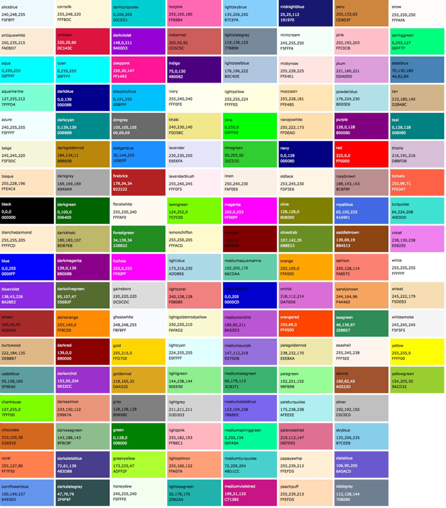
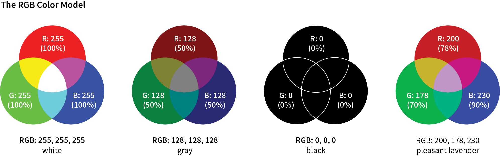
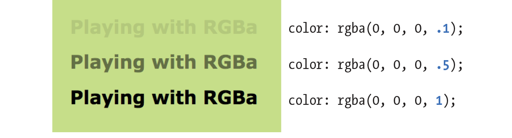
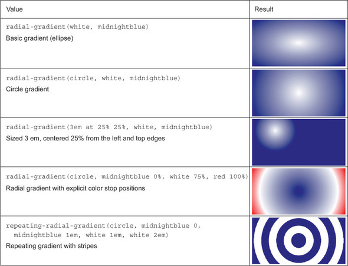
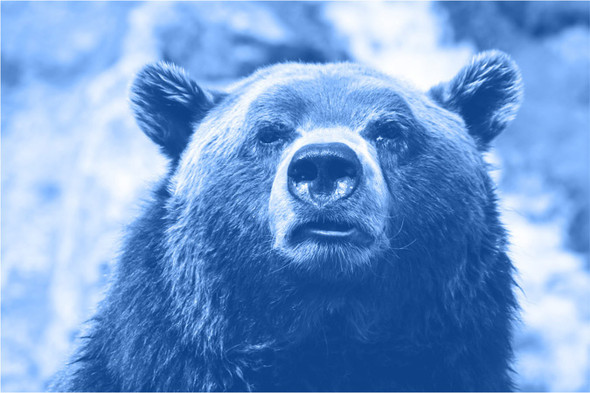
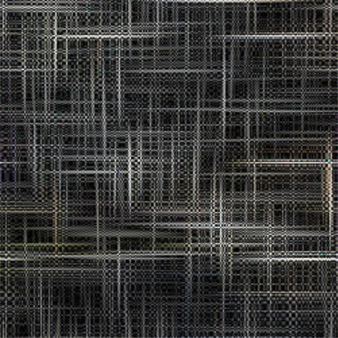
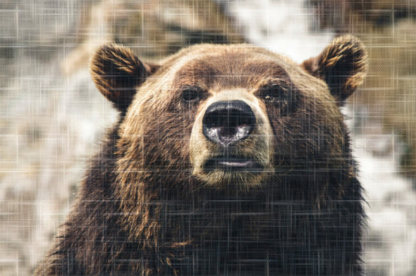

# CSS - Colors and Images

## Colors

CSS4 supports for a set of [140 color names](https://developer.mozilla.org/en-US/docs/Web/CSS/color_value):



Names are easy, but as you can see, they are limited. By far, the most common way to specify a color is by its **RGB value**. It also gives you millions of colors to choose from.



CSS allows RGB color values to be specified in a number of formats:

```
color: rgb(200, 178, 230);
```

You can also list them as percentage values, although that is less common:

```
color: rgb(78%, 70%, 90%);
```

Or, you can provide the six-digit hexadecimal version

```
color: #C8B2E6;
```

If your value happens to be made up of three pairs of double digits or letters, such as

```
color: #FFCC00; or color: #993366;
```

you can condense each pair down to one digit or letter

```
color: #FC0;  or  color: #936;
```

**Picking a color**

- One quick and easy option is to go to Google.com and search "color picker".
- [Cool Flat UI colors](http://flatuicolors.com/)
- Even more [cool colors](http://getuicolors.com/)
- Find [variations of colors](http://www.0to255.com/)

**RGBa Color**

RGBa color allows you to specify a color and make it as transparent or as opaque as you like. The “a” in “RGBa” stands for alpha, which is an additional channel that controls the level of transparency



## Images

- Basically all free images in [one place](http://thestocks.im/)
- [Unsplash](https://unsplash.com/), a must see
- [Food images](http://foodiesfeed.com/)

## Working with the background

When it comes to the `background` property; it's, in fact, a shorthand for eight properties:

| Property                | Description                                                                                                                                                                                                                                                |
| :---------------------- | :--------------------------------------------------------------------------------------------------------------------------------------------------------------------------------------------------------------------------------------------------------- |
| `background-image`      | Specifies an image from a file or a generated color gradient.                                                                                                                                                                                              |
| `background-position`   | Sets the initial position of the background image.                                                                                                                                                                                                         |
| `background-size`       | Specifies how large to render the background image within the element.                                                                                                                                                                                     |
| `background-repeat`     | Determines whether to tile the image if necessary to fill the entire element.                                                                                                                                                                              |
| `background-origin`     | Determines whether background positioning is relative to the element’s border-box, padding-box (initial value), or content-box.                                                                                                                            |
| `background-clip`       | Specifies whether the background should fill the element’s border-box (initial value), padding-box, or content-box.                                                                                                                                        |
| `background-attachment` | Specifies whether the background image will scroll up and down along with the element (the initial value), or if the image will be fixed in place in the viewport. Note that using the value fixed can have negative performance implications on the page. |
| `background-color`      | Specifies a solid background color. This will render behind any background image.                                                                                                                                                                          |

### Gradients

**Linear gradient**

A white to blue **linear gradient**:

```
background-image: linear-gradient(to right, white, blue);
```

The `linear-gradient` function has three parameters defining its behavior: angle, starting color, and ending color. You can also use other color syntaxes, such as `hex (#0000ff)`, `RGB (rgb(0, 0, 255))`, or the `transparent` keyword.

For more precise control of the angle, you can use more specific units, such as degrees. The value `0deg` points straight up (equivalent to to top); higher values move clockwise around the circle, so `90deg` points to the right, `180deg` points down, `360deg` points up again.

You can insert more color stops by adding more colors to the linear-gradient() function.

```css
background-image: linear-gradient(90deg, red, white, blue);
```

You can use `repeating-linear-gradient()` to create stripes in CSS. Example:

```css
.fade {
  height: 1em;
  width: 400px;
  background-image: repeating-linear-gradient(
    -45deg,
    #57b,
    #57b 10px,
    #148 10px,
    #148 20px
  );
  border-radius: 0.3em;
}
```

**Radial gradient**

```css
.fade {
  height: 200px;
  width: 400px;
  background-image: radial-gradient(white, blue);
}
```

By default, the gradient is centered in the element, transitioning evenly to its corners. More examples:



## Shadows

Two properties that create shadows are `box-shadow`, which creates a shadow of an element’s box shape, and `text-shadow`, which creates a shadow of rendered text.


Example:

```css
.button {
  padding: 1em;
  border: 0;
  font-size: 0.8rem;
  color: white;
  border-radius: 0.5em;
  background-image: linear-gradient(to bottom, #57b, #148);
  box-shadow: 0.1em 0.1em 0.5em #124;
}

.button:active {
  box-shadow: inset 0 0 0.5em #124, inset 0 0.5em 1em rgba(0, 0, 0, 0.4);
}
```

The inset shadow adds a ring of shade inside the edges of the element.

Button with flat appearance

```css
.button {
  padding: 1em;
  border: 0;
  color: white;
  background-color: #57b;
  font-size: 1rem;
  padding: 0.8em;
  box-shadow: 0 0.2em 0.2em rgba(0, 0, 0, 0.15);
}
.button:hover {
  background-color: #456ab6;
}
.button:active {
  background-color: #148;
}
```

## Blend modes

When you apply multiple background images, those listed first render in front of those listed afterward. The blend modes control the way stacked images blend together.

### Tinting an image



```html
<div class="blend"></div>
```

```css
.blend {
  min-height: 400px;
  background-image: url("images/bear.jpg");
  background-color: #148;
  background-size: cover;
  background-repeat: no-repeat;
  background-position: center;
  background-blend-mode: luminosity;
}
```

Blend modes in five basic categories

| Type of effect | Blend modes | Description                                                                                          |
| :------------- | :---------- | :--------------------------------------------------------------------------------------------------- |
| Darken         | multiply    | The lighter the front color, the more the base color will show through.                              |
|                | darken      | Selects darker of the two colors.                                                                    |  | color-burn | Darkens the base color, increasing contrast. |
| Lighten        | screen      | The darker the front color, the more the base color will show through.                               |
|                | lighten     | Selects the lighter of the colors.                                                                   |
|                | color-dodge | Lightens base color, decreasing contrast.                                                            |
| Contrast       | overlay     | Increases contrast by applying multiply to dark colors and screen to light colors, at half strength. |
|                | hard-light  | Greatly increases contrast. Like *overlay*, but applies multiply or screen at full strength.         |
|                | soft-light  | Similar to hard-light, but uses burn/dodge instead of multiply/screen.                               |
| Composite      | hue         | Applies hue from the top color onto the bottom color.                                                |
|                | saturation  | Applies saturation from the top color onto the bottom color.                                         |
|                | luminosity  | Applies luminosity from the top color onto the bottom color.                                         |
|                | color       | Applies hue and saturation from the top color onto the bottom color.                                 |
| Comparative    | difference  | Subtracts the darker color from the lighter one.                                                     |
|                | exclusion   | Similar to difference, with less contrast.                                                           |

### Adding texture to image




```css
.blend {
  min-height: 400px;
  background-image: url("images/scratches.jpg"), url("images/bear.jpg");
  background-size: 200px, cover;
  background-repeat: repeat, no-repeat;
  background-position: center center;
  background-blend-mode: soft-light;
}
```

### `mix-blend-mode`

Although the `background-blend-mode` property lets you blend multiple images, it’s limited to the background colors or images of one element. Another property, `mix-blend-mode`, lets you blend multiple elements.

HTML:

```html
<div class="blend">
  <h1>Ursa Major</h1>
</div>
```

CSS:

```css
.blend {
  background-image: url("images/bear.jpg");
  background-size: cover;
  background-position: center;
  padding: 5em 0 10em;
}

.blend > h1 {
  margin: 0;
  font-family: Helvetica, Arial, sans-serif;
  font-size: 6rem;
  text-align: center;
  mix-blend-mode: hard-light;
  background-color: #c33;
  color: #808080;
  border: 0.1em solid #ccc;
  border-width: 0.1em 0;
}
```


## Additional reading

- [Text on Images](https://css-tricks.com/design-considerations-text-images/)
- [Beautiful gradients for webdesign](http://uigradients.com/)
- [Stripes in CSS](https://css-tricks.com/stripes-css/)
- [MDN Radial Gradient](https://developer.mozilla.org/en-US/docs/Web/CSS/radial-gradient)
- [CSS Gradient](https://cssgradient.io/)
