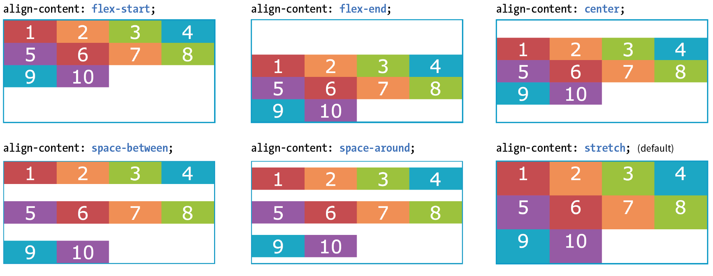

# Flexbox

Flexbox begins with the `display` property. Applying `display: flex` to an element turns it into a *flex container*, and its direct children turn into *flex items*. By default, flex items align **side by side, left to right, all in one row**. The flex container fills the available width like a block element, but the flex items may not necessarily fill the width of their flex container. The flex items are all **the same height**, determined naturally by their contents.

That means it allows items to stretch or shrink inside their containers, preventing wasted space and overflow. It's a real plus for making layouts fit a variety of viewport sizes. Other advantages:

- Make all neighboring items the same height
- Easy horizontal and vertical centering
- The ability to change the order in which items display, independent of the source

Because flexbox layout is defined in terms of the *main axis* and *cross axis*, we use the terms **start** and **end** in reference to the axes, rather than left and right or top and bottom.

Let walkthrough the syntax with <a href="https://flexboxfroggy.com" target="_blank">this game</a>.

Another <a href="" target="_blank">example</a>.

## Quick summary

### Container properties

| Property | Example |
|:--|:--:|
| `flex-direction` | ``

 |
| `flex-wrap` | 

 |
| `justify-content` | 

 |
| `align-items`: container height required | 

 |
| `align-content`: csscontainer height required | 

 |

### Flex item properties

- `flex: flex-frow flex-shrink flex-basis`: For the `flex-grow` and `flex-shrink` properties, the values 1 and 0 work like on/off switches, where 1 “turns on” or allows an item to grow or shrink, and 0 prevents it. The flex-basis property sets the starting dimensions, either to a specific size or a size based on the contents. Example `flex: 1 0 200px;`: a list item starts at 200 pixels wide, is allowed to expand to fill extra space (1), but is not allowed to shrink (0) narrower than the original 200 pixels.

- `flex-flow`: If you set the flex-grow value for all the items in a container to 1, the browser takes whatever extra space is available along the main axis and applies it equally to each item, allowing them all to stretch the same amount. If you specify a higher flex-grow integer to an item, it acts as a ratio that applies more space within that item. For example, giving “box4” the value `flex-grow: 3` means that it receives three times the amount of space than the remaining items set to `flex-grow: 1`

- `flex-shrink`: By default, the flex-shrink value is set to 1, which means if you do nothing, items shrink to fit at the same rate. When `flex-shrink` is 0, items are not permitted to shrink.  Finally, as in `flex-grow`, a higher integer works as a ratio. An item with a `flex-shrink` of 2 will shrink twice as fast as if it were set to 1.

- `flex-basis`: The third `flex` value defines the starting size of the item before any wrapping, growing, or shrinking occurs. It may be used instead of the width property (or height property for columns) for flex items.

- Handy shortcut flex values:
  - `flex: initial;` is the same as `flex: 0 1 auto;`: It prevents the flex item from growing even when there is extra space, but allows it to shrink to fit in the container.
  - `flex: auto` is the same as `flex: 0 0 auto`: It creates a completely inflexible flex item while sizing it to the width and height properties.
  - `flex: an_integer_number` is the same as `flex: an_integer_number 1 0px;`: absolute flex. With a basis of 0, the items get sized proportionally according to the flex ratios.

  

## Additional reading

- [A complete guide to Flexbox](https://css-tricks.com/snippets/css/a-guide-to-flexbox/)