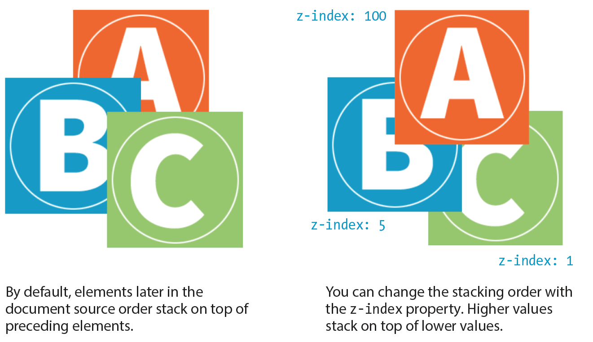
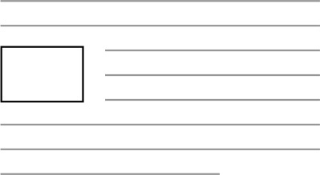

# CSS - Floating, Positioning and Stacking

## Types of positioning

Positioning is a way to specify the location of an element anywhere on the page with pixel precision.

Property: **position**

Values: `static` | `relative` | `absolute` | `fixed` | `sticky` 

Default: `static`

Applies to: all elements

Inherits: no

- **static**: The normal position scheme in which elements are positioned as they occur in the normal document flow
- **relative**: Relative positioning moves the element box **relative to its original position** in the flow. The distinctive behavior of relative positioning is that the space the element would have occupied in the normal flow is preserved as empty space. Relative positioning is commonly used to create a “positioning context” for an absolutely positioned element. 
- **absolute**: Absolutely positioned elements are removed from the document flow entirely and positioned with respect to the viewport or a containing element. Basically:
  - If the positioned element is not contained within another positioned element, then it will be placed relative to the initial containing block (created by the `html` element).
  - But if the element has an ancestor (i.e., is contained within an element) that has its position set to **relative**, **absolute**, or **fixed**, the element will be positioned relative to the edges of that element instead.
  Unlike relatively positioned elements, the space they would have occupied is closed up. In fact, they have no influence at all on the layout of surrounding elements.
- **fixed**: The distinguishing characteristic of fixed positioning is that the element stays in one position in the viewport even when the document scrolls. Fixed elements are removed from the document flow and positioned relative to the viewport rather than another element in the document.
- **sticky**: Sticky positioning is a combination of relative and fixed in that it behaves as though it is relatively positioned, until it is scrolled into a specified position relative to the viewport, at which point it remains fixed.

Once you’ve established the positioning method, the actual position is specified with some combination of up to four offset properties: `top`, `right`, `bottom`, `left`. 

**Note**: *negative values are acceptable and move the element in the opposite direction of positive values. For example, a negative value for `top` would have the effect of moving the element up.*

## Stacking Order

By default, elements stack up in the order in which they appear in the document, but you can change the stacking order with the `z-index` property. 

Property: **z-index**

Values: number | `auto`

Default: `auto`

Applies to: positioned elements

Inherits: no

The value of the `z-index` property is a number (positive or negative). The higher the number, the higher the element will appear in the stack (that is, closer to your nose).

## Floating

**Floating** an element moves it to either the left or right side as far as possible. The following siblings will **wrap around** the floating element. This layout is common in newspapers and magazines, so floats were added to CSS to achieve this effect.

Property: **float**

Values: `left` | `right` | `none`

Default: `none`

Applies to: all elements

Inherits: no

## Additional reading

- [You can center things in CSS](https://css-tricks.com/centering-css-complete-guide/)
- [CSS Reference - Positioning](https://cssreference.io/positioning/)