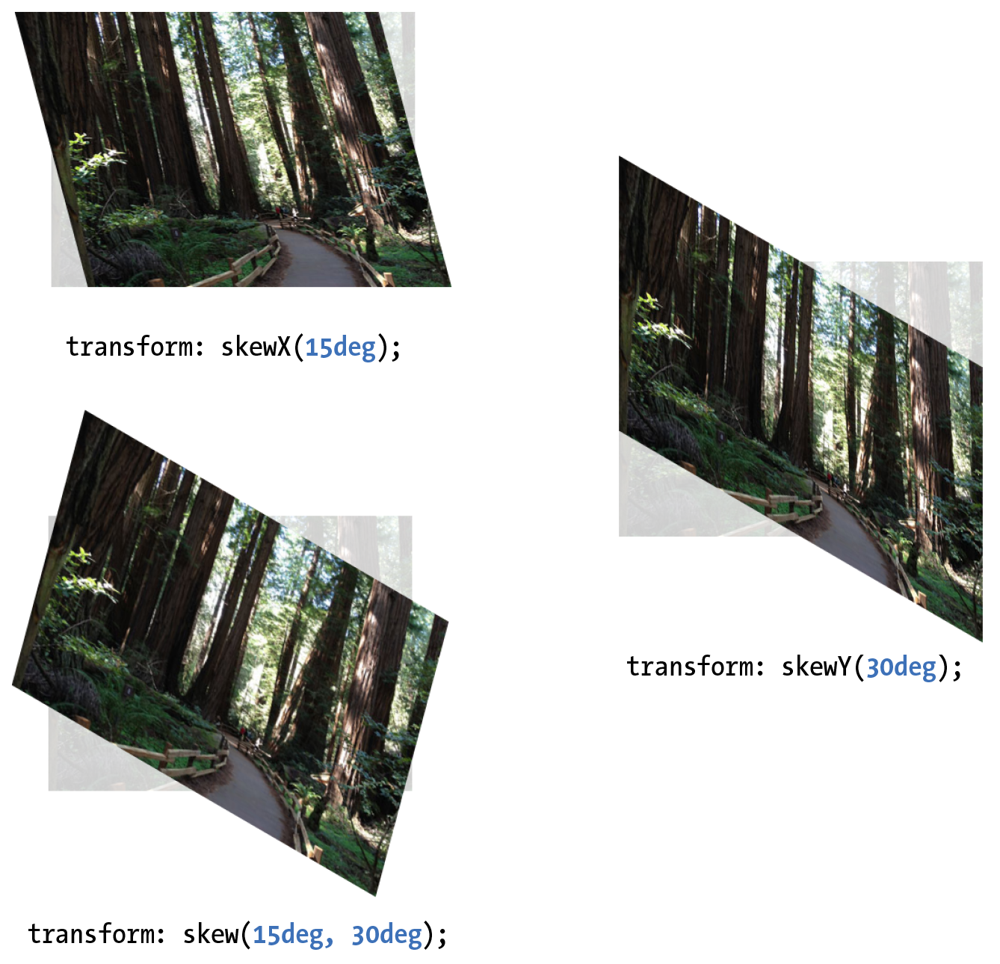

# CSS - Transitions and Transforms

CSS Transition make style changes fade smoothly from one to another.

CSS Transform is for repositioning, scaling, rotating, and skewing elements.

## CSS Transition

When applying a transition, you have a few decisions to make, each of which is set with a CSS property:

- `transition-property` (**required**): which CSS property to change.
- `transition-duration` (**required**): how long it should take.
- `transition-timing-function`: the manner in which the transition accelerates.
- `transition-delay`: whether there should be a pause before it starts.

Transitions require a beginning state and end state. The element at it appears when it first load is the beginning state. The end state needs to be triggered by a state change such as `:hover`, `:focus`, or `:active`. Example:

HTML: 

`<a href="…" class="smooth">awesomesauce</a>`

CSS:

```css
.smooth {  
  display: block;   
  text-decoration:none;   
  text-align: center;  
  padding: 1em 2em;  
  width: 10em;  
  border-radius: 1.5em;  
  color: #fff;  
  background-color: mediumblue;  
  transition-property: background-color;  
  transition-duration: 0.3s;
}

.smooth:hover, .smooth:focus {  
  background-color: red;
}
```

**`transition-timing-function`**

Values: `ease` | `linear` | `ease-in` | `ease-out` | `ease-in-out` | `step-start` | `step-end` | `steps` | `cubic-bezier(#,#,#,#)`

Default: `ease`

Applies to: all elements, :before and :after pseudo-elements

Inherits: no

| Value | Description |
|:--|:--|
| `ease` | Starts slowly, accelerates quickly, and then slows down at the end. This is the default value and works just fine for most short transitions. | 
| `linear` | Stays consistent from the transition’s beginning to end. Because it is so consistent, some say it has a mechanical feeling. |
| `ease-in` | Starts slowly, then speeds up. |
| `ease-out` | Starts out fast, then slows down. |
| `ease-in-out` | Starts slowly, speeds up, and then slows down again at the very end. It is similar to ease, but with less pronounced acceleration in the middle. |
| `step-start` | Changes states in one step, at the beginning of the duration time (the same as steps(1,start)). The result is a sudden state change, the same as if no transition had been applied at all. |
| `step-end` | Changes states in one step, at the end of the duration time (the same as steps(1,end)). |
| `steps(#steps, start or end)` | Divides the transitions into a number of steps as defined by a stepping function. The first value is the **number of steps**, and the **start** and **end** keywords define whether the change in state happens at the beginning (start) or end of each step. |
| `cubic-bezier(#,#,#,#)`| The acceleration of a transition can be plotted with a curve called a Bezier curve. The site http://cubic-bezier.com/ is a greate tool for playing around. |

**The shorthand transition property**

CSS3 gives us the shorthand `transition` property to combine all of these properties into one declaration:

```css
transition: property duration timing-function delay;
```

Example:

```css
.smooth {  
  ...  
  transition: background-color 0.3s ease-in-out 0.2s;
}
```

## CSS Transform

**Property**: `transform`

**Values**: `rotate()` | `rotateX()` | `rotateY()` | `rotateZ()` | `rotate3d()` | `translate()` | `translateX()` | `translateY()` | `scale()` | `scaleX()` | `scaleY()` | `skew()` | `skewX()` | `skewY()` | `none`

**Default**: none

**Applies to**: transformable elements





**Transformable elements**:

- HTML elements with replaced content, such as img, canvas, form inputs, and embedded media

- Elements with their `display` set to `block`, `inline-block`, and `flex`

## Additional reading

- [Using Multi-Step Animations and Transitions](http://css-tricks.com/using-multi-step-animations-transitions/)
- [Animate.css by Daniel Eden](http://daneden.github.io/animate.css/)
- [CSS Animation Cheat Sheet](http://www.justinaguilar.com/animations/index.html)