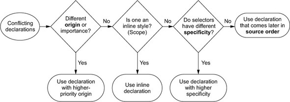
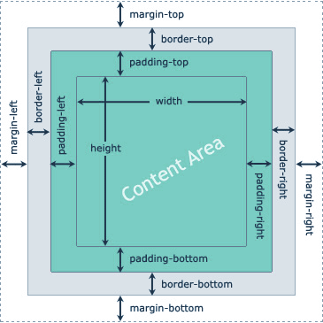

# Intro to CSS

Cascading Stylesheets (CSS) is the code that you use to style your website.

## Anatomy of a CSS ruleset


This whole structure is called a **ruleset**. A ruleset consists of:

- **Selector**: defines the element(s) to be styled.
- **Declaration**: is a single rule which specifies which of the element's properties you want to style.
- **Properties**: are the way you can style an HTML element.
- **Property value**: is one out of many possible appearances for a given property. (For example there are many `color` values, like `red`, `blue`, etc.)

The important part of the syntax:

- Each ruleset must be wrapped in curly braces `{}`.
- Use a colon `:` to separate the property from its value(s).
- Use a semicolon `;` to separate each declaration from the next one.

## Types of selectors

| Selector type             | Meaning                                                                                                          | Example                                                                                                           |
| :------------------------ | :--------------------------------------------------------------------------------------------------------------- | :---------------------------------------------------------------------------------------------------------------- |
| Element (or Tag) selector | HTML elements of the specified type                                                                              | `p` or `li` or `h1`                                                                                               |
| ID selector               | The element on the page with the specified ID. On a given HTML page, each id value should be unique.             | `#my-id` selects `<p id="my-id">` or `<a id="my-id">`, to select the `p` element use `p#my-id`                    |
| Class selector            | The element(s) on the page with the specified class. Multiple instances of the same class can appear on a page.  | `.my-class` selects `<p class="my-class">` and `<a class="my-class">`, to select the `a` element use `a.my-class` |
| Attribute selector        | The element(s) on the page with the specified attribute.                                                         | `img[src]` selects `` but not ``                                                      |
| Pseudo-class selector     | The specified element(s), but only when in the specified state. (For example, when a cursor hovers over a link.) | `a:hover` selects `<a>`, but only when the mouse pointer is hovering over the link.                               |
| Pseudo-element selector   | The specified parts of an element                                                                                | `p::first-letter` selects the first letter of paragraphs                                                          |
| Combinators               | Combine selectors in order to target elements                                                                    | `article > p {}` selects paragraphs that are direct children of `<article>` elements                              |

**Common selectors and combinators**

| Selector | Type                          | Description                                                                               |
| :------- | :---------------------------- | :---------------------------------------------------------------------------------------- |
| \*       | Universal selector            | Matches any element                                                                       |
| A        | Type selector                 | Matches any element                                                                       |
| A, B     | Compound selector             | Matches elements A and B                                                                  |
| A B      | Descendant combinator         | Matches B only if it is descendant of element A                                           |
| A>B      | Child combinator              | Matches element B that is a child of element A                                            |
| A+B      | Next-sibling combinator       | Matches element B that immediately follows element A, where A and B share the same parent |
| A~B      | Subsequent-sibling combinator | Matches element B that is preceded by A, where A and B share the same parent              |

**Common pseudo-element selectors**

| Selector         | Type                    | Description                                                                                 |
| :--------------- | :---------------------- | :------------------------------------------------------------------------------------------ |
| `::before`       | Pseudo-element selector | Inserts generated text at the beginning of the specified element and applies a style to it. |
| `::after`        | Pseudo-element selector | Inserts generated content at the end of the specified element and applies a style to it.    |
| `::first-letter` | Pseudo-element selector | Selects the first letter of the specified element.                                          |
| `::first-line`   | Pseudo-element selector | Selects the first letter of the specified element.                                          |

**Common pseudo-class selectors**

| Selector       | Type                                  | Description                                                                                                                         |
| :------------- | :------------------------------------ | :---------------------------------------------------------------------------------------------------------------------------------- |
| `:root`        | Tree-structural pseudo-class selector | Selects an element that is the root of the document. In HTML, it is the html element.                                               |
| `:link`        | Link pseudo-class selector            | Specifies a style for links that have not yet been visited.                                                                         |
| `:visited`     | Link pseudo-class selector            | Specifies a style for links that have already been visited.                                                                         |
| `:active`      | User action pseudo-class selector     | Selects any element that has been activated by the user, such                                                                       | as a link as it is being clicked. |
| `:hover`       | User-action pseudo-class selector     | Specifies a style for elements (typically links) that appear                                                                        | when the mouse is placed over them. |
| `:focus`       | User action pseudo-class selector     | Selects any element that currently has the input focus, such as                                                                     | a selected form input. |
| `:first-child` | Structural pseudo-class selector      | Selects an element that is the first child of its parent element.                                                                   |
| `:last-child`  | Structural pseudo-class selector      | Selects an element that is the last child of its parent element.                                                                    |
| `:only-child`  | Structural pseudo-class selector      | Selects an element that is the only child of its parent.                                                                            |
| `:nth-child()` | Structural pseudo-class selector      | Selects an element that is the nth child of its parent. The notation can include a number, a notation, or the keywords odd or even. |

## Attaching the styles to the document

There are three ways that style rules can be applied to an HTML document:

- **Inline styles**: Applying properties and values to a single element by using **style** attribute in the element itself. Examle `<h1 style="color: red; background-color: white">CoderSchool</h1>`
  Inline styles should be avoided. They are problematic in that they merge presentation information into the structural markup and make it more difficult to make changes.

- **Embedded style sheets**: are placed in a HTML document via the **style** element. The **style** element must be placed in the **head** of the document

  ```html
  <head>
    <title>Example of embedded style sheets</title>
    <style>
      /* style rules go here */
    </style>
  </head>
  ```

- **External style sheets**: The external `.css` file that contains a number of style rules. The `.css` document is then linked to the HTML documents. This is the most powerful and preferred method for attaching style sheets to content.

## Important concepts

### Inheritance

Some CSS properties by default inherit values set on the current element's parent element, and some don't. This can also cause some behavior that you might not expect.

**Inherited properties:**

- Properties pertaining to text: `color`, `font`, `font-family`, `font-size`, `font-weight`, `font-variant`, `font-style`, `line-height`, `letter-spacing`, `text-align`, `text-indent`, `text-transform`, `white-space`, and `word-spacing`.
- The list properties: `list-style`, `list-style -type`, `list-style-position`, and `list-style-image`.

It's common to apply a `font-family` to the `<body>` element. All the descended elements within will then inherit this font; you don't have to apply it explicitly to each element on the page.

Some properties do not inherit — for example if you set a `width` of 50% on an element, all of its descendants do not get a width of 50% of their parent's width.

### The Cascade

Fundamentally, CSS is about declaring rules: Under various conditions, we want certain things to happen. If this class is added to that element, apply these styles. If element X is a child of element Y, apply those styles. The browser then takes these rules, figures out which ones apply where, and uses them to render the page.

Each rule may be straightforward on its own, but what happens when two rules provide conflicting information about how to style an element? The cascade determines how conflicts are resolved, and it’s a fundamental part of how the language works.



- **Style sheet origin**: The style sheets you add to your web page aren't the only one the browser applies. Yours are called author styles; there are also user agent styles, which are the browser’s default styles. User agent styles have lower priority, so your styles override them.

- **importance**: Declarations marked `!important` are treated as a higher-priority origin. A declaration can be marked important by adding !important to the end of the declaration, before the semicolon: `color: red !important;`

- **Specificity**: If conflicting declarations can’t be resolved based on their origin, the browser next tries to resolve them by looking at their specificity. **Understanding specificity is essential.**

  - If a selector has more IDs, it wins (that is, it’s more specific).
  - If that results in a tie, the selector with the most classes wins.
  - If that results in a tie, the selector with the most tag names wins.

  ```css
  /* four tags (the least specific) */
  html body header h1 {
    color: blue;
  }
  /* three tags and one class */
  body header.page-header h1 {
    color: orange;
  }
  /* two classes */
  .page-header .title {
    color: green;
  }
  /* one ID (the most specific)*/
  #page-title {
    color: red;
  }
  ```

  - Pseudo-class selectors (for example, `:hover`) and attribute selectors (for example, `[type="input"]`) each have the same specificity as a class selector.
  - The universal selector (`*`) and combinators (`>`, `+`, `~`) have no effect on specificity.

  If you add a declaration to your CSS and it seems to have no effect, often it’s because a more specific rule is overriding it.

- **The order of CSS rules matter**: when two rules apply that have equal specificity the one that comes last in the CSS is the one that will be used. This listing shows styles for links on a page in the “correct” order.

  ```css
  a:link {
    color: blue;
    text-decoration: none;
  }

  a:visited {
    color: purple;
  }

  a:hover {
    text-decoration: underline;
  }

  a:active {
    color: red;
  }
  /* mnemonic: LoVe/HAte */
  ```

### Absolute & Relative units

**Absolute length units** are fixed to a physical length.

| Unit | Name        | Equivalent to       |
| :--- | :---------- | :------------------ |
| cm   | Centimeters | 1cm = 96px/2.54     |
| mm   | Millimeters | 1mm = 1/10th of 1cm |
| in   | Inches      | 1in = 2.54cm = 96px |
| pc   | Picas       | 1pc = 1/16th of 1in |
| pt   | Points      | 1pt = 1/72th of 1in |
| px   | Pixels      | 1px = 1/96th of 1in |

**Relative length units** specify a length in relation to something else.

| Unit   | Relative to                         |
| ------ | ----------------------------------- |
| `em`   | Font size of the element.           |
| `rem`  | Font size of the root element.      |
| `vw`   | 1% of viewport's width.             |
| `vh`   | 1% of viewport's height.            |
| `vmin` | 1% of viewport's smaller dimension. |
| `vmax` | 1% of viewport's larger dimension.  |

**The `calc()` function** lets you do basic arithmetic(`+`, `-`, `*`, `/`,) with two or more values. This is particularly useful for combining values that are measured in different units. For example

```css
:root {
  font-size: calc(0.5em + 1vw);
}
```

The 0.5 em here operates as a sort of minimum font size, and the 1 vw adds a responsive scalar.

**The `var()` function** allows the use of variables. In this example, we define a variable named `--main-font` for the whole page, and apply it to all `p` elements:

```css
:root {
  --main-font: Helvetica, Arial, sans-serif;
  --brand-color: #369;
}

p {
  font-family: var(--main-font);
  color: var(--brand-color, blue);
}
```

The `var()` function accepts a second parameter, which specifies a fallback value. In the example, if the `--brand-color` variable is not defined, so the fallback value blue is used.

### The box model



CSS layout is mostly based on the **box model**. Each box taking up space on your page has properties like:

- `padding`, the space around the content. In the example below, it is the space around the paragraph text.
- `border`, the solid line that is just outside the padding.
- `margin`, the space around the outside of the border.

**Using `box-sizing: border-box`** to specify width to include the padding and borders. By default, `box-sizing` is set to the value `content-box` (`height` and `width` only set the size of the content box).

**Using universal `border-box` sizing**:

```css
/* Applies border box sizing to the root element */
:root {
  box-sizing: border-box;
}

/* Tells all other elements and pseudo-element to inherit their box sizing */
*,
::before,
::after {
  box-sizing: inherit;
}
```

## References

- [MDN: CSS Selectors](https://developer.mozilla.org/en-US/docs/Learn/CSS/Building_blocks/Selectors)
- [MDN: Common CSS Properties Reference](https://developer.mozilla.org/en-US/docs/Web/CSS/CSS_Properties_Reference)
- [MDN: Pseudo-classes and pseudo-elements](https://developer.mozilla.org/en-US/docs/Learn/CSS/Building_blocks/Selectors/Pseudo-classes_and_pseudo-elements)

## Additional Reading

- [CSS Tricks](https://css-tricks.com/): The is the blog of CSS guru Chris Coyier. Chris loves CSS and enthusiastically shares his research and tinkering on his site.
- [A List Apart](https://alistapart.com/blog/topic/css/): This online magazine features some of the best thinking and writing on cutting-edge, standards-based web design. It was founded in 1998 by Jeffrey Zeldman and Brian Platz.
