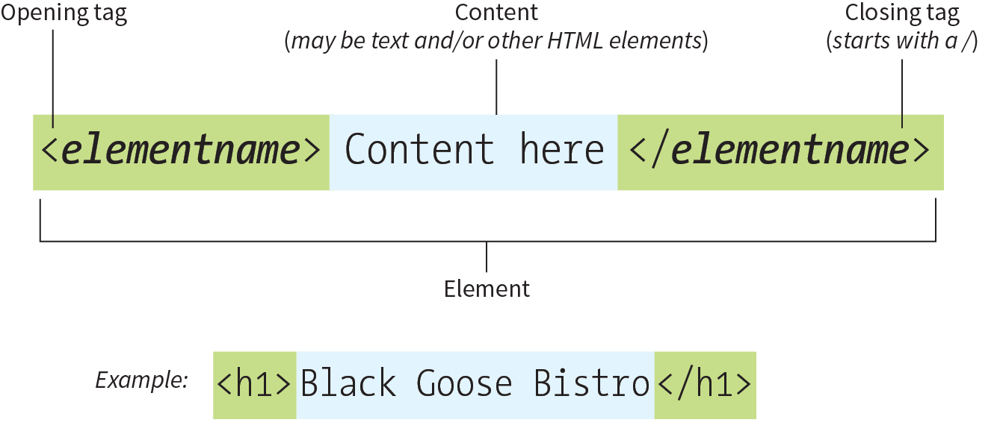
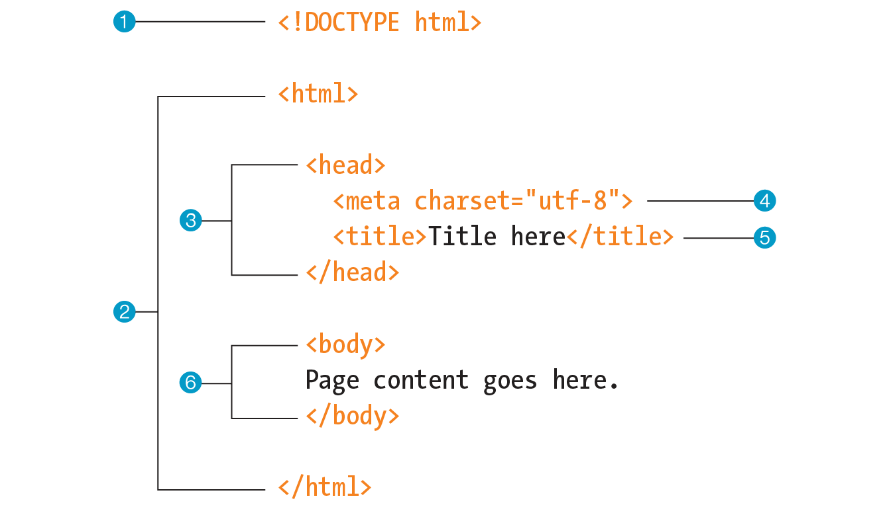
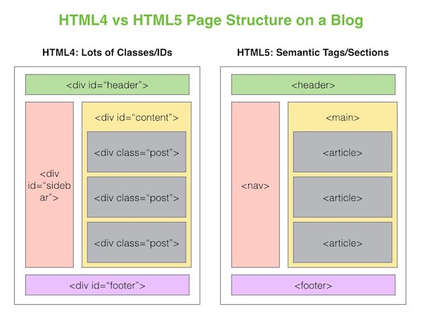

# Intro to HTML

The front-end of the web is based on three major technologies:

- **HTML aka "STRUCTURE"**: HyperText Markup Language (HTML) defines the structure, content and semantics of web pages on the web.
- **CSS aka "PRESENTATION"**: Cascading Style Sheets (CSS) sets the look and style of a web page. CSS provides style to the structure provided by HTML.
- **JavaScript aka "BEHAVIOR"**: JavaScript allows us to define interaction in our pages. What happens when a user clicks on a certain area?

Today, we will build a foundation of HTML knowledge and skills.

## What is HTML?

HTML is used to create electronic documents (pages) that are displayed on the Web.

HTML ensures the proper formatting of content (text, images, video) so that your browser can display them as intended. As a result, HTML is made up of many elements. These elements are used to hold our content and define how the browser must format and display the content. The term markup refers to the set of tags used to structure a page.

## The anatomy of an HTML Element

**Elements** are identified by **tags**. A tag consists of the element name within angle brackets (`< >`). A tag starts with an **opening tag** and ends with a **closing tag** preceded by `</`. The tags are referred to as the markup.

Elements which are created with only one tag are called empty elements (also known as self-closing elements) and cannot have any child elements. Examples of this are `` and `<input>`.

In HTML, the capitalization of element names is not important. So ``, ``, and `` are all the same. However, most developers prefer the consistency of writing element names in all lowercase.

### Block and inline elements

Every HTML element has a default `display` value. `block` and `inline` are the default values for most of the elements.

This is an important distinction:

- A block element always starts on a new line and stretches out to the left and right as far as it can. Block elements stack on top of each other. Each one starts and ends on its own line.
- Inline elements do not start new lines and take up only the necessary width; they just go with the flow.

Most elements are block elements. Some common inline tags you might see used:

- `<em>` is used to denote that you’d like to emphasize some text.
- `<strong>` is used to denote that this text is important.
- `` is a generic inline container (similar to `
` which is a block element)

### What browsers ignore

The following information in the source document will be ignored when it is viewed in a browser:

- **Multiple-character white spaces**: When a browser encounters more than one consecutive white spaces, it displays a single space.
  Example, if the document contains `hello, world !`, the browser displays `hello, world !`.

- **Line breaks & tabs**:
  Browsers convert line breaks and tabs to white spaces, so following the earlier "ignore multiple white spaces" rule, they have no effect on formatting the page.

- **Text in comments**:
  Browsers do not display text between the special `<!--` and `-->` tags used to denote a comment. Comments are useful for labeling and organizing long documents, particularly when they are shared by a team of developers. Although the browser will not display comments in the web page, readers can see them if they "view source," so be sure that the comments you leave are appropriate for everyone.

- **Unrecognized markup**:
  Browsers are instructed to ignore any tag they don’t understand or that was specified incorrectly. Depending on the element and the browser, this can have varied results. The browser may display nothing at all, or it may display the contents of the tag as though it were normal text.

## Basic document structure

The purpose of HTML is to add meaning and structure to the content. It is not intended to describe how the content should look.

The minimal structure of an HTML document includes `head` and `body` contained within the `html` root element:

1. The first line is a document type declaration (also called **DOCTYPE**) that lets browsers know which HTML specification to use to interpret the document. This DOCTYPE identifies the document as written in **HTML5**.`

2. The entire document is contained within an `html` element. The `html` element is called the root element because it contains all the elements in the document, and it may not be contained within any other element.

3. Within the `html` element, the document is divided into a `head` and a `body`. The `head` element contains elements that pertain to the document that are not rendered as part of the content, such as its title, style sheets, scripts, and metadata.

4. **meta elements** provide document metadata, information about the document. In this case, it specifies the character encoding (a standardized collection of letters, numbers, and symbols) used in the document as Unicode version UTF-8 (see the sidebar "Introducing Unicode").

5. The `title` element is required in the `head`. Every document must contain a descriptive title.

6. Finally, the `body` element contains everything that we want to show up in the browser window.

The document structure, the way elements follow each other or nest within one another, creates relationships between elements. The underlying document hierarchy has a technical name is the **DOM (Document Object Model)**. DOM is also the foundation upon which we add presentation instructions with style sheets and behaviors with JavaScript.

### Semantic HTML

HTML5 has a variety of semantic tags that provide additional meaning through descriptive naming, available for us to use. They don’t provide any visual difference, but they can make our code more understandable and clear to other developers (and our future selves) by organizing content.

Before we had semantic tags like `<main>`, `<section>` and more, developers would use `
` tags to organize content. `
`’s are still really useful elements, but we should aim to use more semantic tags for organizing large blocks of your HTML code.

When we want to convey semantic meaning, we can use one the following containing elements:

- header
- nav
- section
- article
- aside
- footer

## References

- [MDN HTML Overview](https://developer.mozilla.org/en-US/docs/Web/HTML)
- [MDN HTML Elements](https://developer.mozilla.org/en-US/docs/Web/HTML/Element)
- [HTML Elements](https://htmlreference.io/)
- [A simple guide to HTML (cheatsheet)](http://www.simplehtmlguide.com/cheatsheet.php)

## Additional reading

- [8 best practices to write clean HTML code](https://medium.com/@sergimarquez/8-best-practices-to-write-clean-html-code-1cd407e2a7ec)
