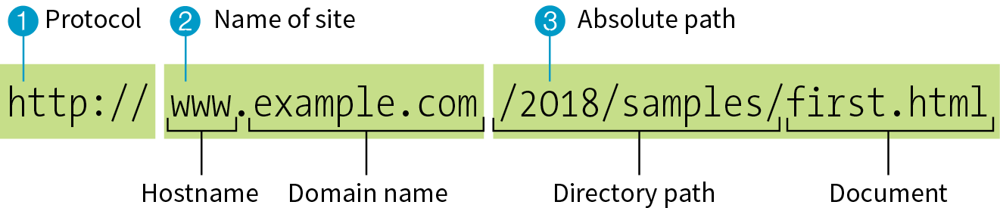
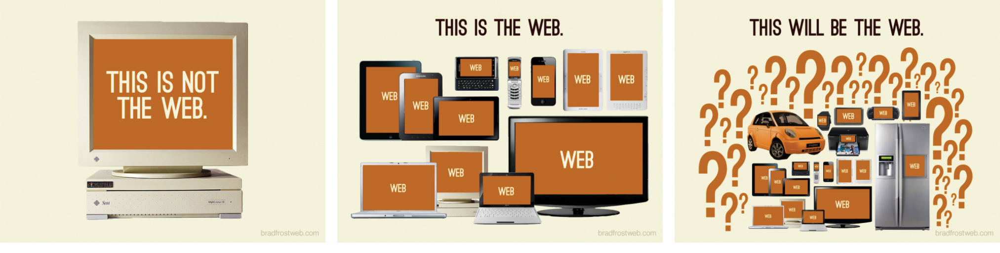

# How the web works

## How the internet works

The **internet** is an international network of connected computers. No company owns the internet; it is a cooperative effort governed by a system of standards and rules. The purpose of the internet is to share information. There are many ways information can be passed between computers, including email (POP3/IMAP/SMTP), file transfer (FTP), secure shell (SSH), and many more specialized modes upon which the internet is built. These standardized methods for transferring data or documents over a network are known as protocols.

Another excellent explanation: [How the internet works in 5 minutes](https://www.youtube.com/watch?v=7_LPdttKXPc)

Vocab:

* **servers**: 
  The computers that make up the internet. Because they “serve up” documents upon request, these computers are known as **servers**. The role of server is to wait for a request for information, and then retrieve and send that information back as quickly as possible.

* **IP address (Internet Protocol)**: 
  Every computer and device (router, smartphone, car, etc.) connected to the internet is assigned a unique numeric **IP address**.

* **DNS (Domain Name System)**: 
  DNS allows us to refer to servers by their domain name. Matching the text domain names to their respective numeric IP addresses is the job of a separate **DNS server**. If you think of an IP address as a telephone number, the DNS server would be the phonebook.

* **Server-side** and **Client-side**:
  Often in web design, you’ll hear references to “client-side” or “server-side” applications. These terms are used to indicate which machine is doing the processing. Client-side applications run on the user’s machine (also referred to as the frontend), while server-side applications and functions use the processing power of the server computer (the backend).

  The program that is responsible for converting HTML and CSS into what you see rendered on the screen is called a **rendering engine** (also **browser engine**). Browsers that you use on desktop computers and mobile devices are made up of rendering engines as well as other code used for their own user interfaces and functionality.

## A brief history of the web

The **web**, originally called the **World Wide Web(www)**, is just one of the ways information can be shared over the internet. It allows documents to be linked to another via **hypertext** links thus forming a huge "web" of connected information.

The web was born in a particle physics laboratory (CERN) in Geneva, Switzerland, in 1989. There a computer specialist named Tim Berners-Lee first proposed a system of information management that used a “hypertext” process to link related documents over a network. He and his partner, Robert Cailliau, created a prototype and released it for review. For the first several years, web pages were text-only. It’s difficult to believe that in 1992, the world had only about 50 web servers, total. The real boost to the web’s popularity came in 1992 when the first graphical browser (NCSA Mosaic) was introduced, and the web broke out of the realm of scientific research into mass media.

## Web page addresses (URLs)

Every page and resource on the web has its own special address called a **URL**, which stands for **Uniform Resource Locator**.

The W3C and the development community are moving away from the term **URL (Uniform Resource Locator)** and toward the more generic and technically accurate **URI (Uniform Resource Identifier)**. On the street and even on the job, however, you’re still likely to hear URL.

- `http://`:
  The first thing the URL does is to define the protocol that will be used for that particular transaction. The letters “HTTP” let the server know to use HyperText Transfer Protocol, or get into “web mode.” You may also see a URL begin with https://, which I explain in the “HTTPS, The Secure Web Protocol” sidebar.

- `www.example.com`
  The next portion of the URL identifies the website by its domain name. In this example, the domain name is “example.com.” The “www.” part at the beginning is the particular hostname at that domain. The hostname “www” has become a convention, but is not a rule. In fact, sometimes the hostname may be omitted. There can be more than one website at a domain (called subdomains). For example, there might also be “development.example.com,” “clients.example.com,” and so on.

- `/2018/samples/first.html`
  This is the absolute path through directories on the server to the requested HTML document, first.html. The words separated by slashes are the directory names, starting with the root directory of the host (as indicated by the initial /). Because the internet originally comprised computers running the Unix operating system, our current way of doing things still follows Unix rules and conventions, hence the / separating directory names.

To sum it up, the URL says it would like to use the HTTP protocol to connect to a web server on the internet called “www.example.com” and to request the document first.html, located in the samples directory, which is in the 2018 directory.

## Responsive Web Design

The heart of the matter is that as web designers, we never know exactly how the pages we create will be viewed. Until 2007, we could be relatively certain that our users were visiting our sites while sitting at their desks, looking at a large monitor, using a speedy internet connection. Back then, we’ve seen the introduction of phones and tablets of all different dimensions, as well as web browsers on TVs, gaming systems, and other devices. And the diversity is only going to increase. 

**Responsive Web Design (RWD)** is a strategy for providing appropriate layouts to devices based on the size of the viewport (browser window). The key to Responsive Web Design is serving a single HTML document (with one URL) to all devices, but applying different style sheets based on the screen size in order to provide the most optimized layout for that device. It’s like magic! (Except that it’s actually just CSS.)

## Summary

To wrap up our introduction to how the web works, let’s trace a typical stream of events that occurs with every web page that appears on your screen:

- Request a web page by either typing its URL (for example, https://www.coderschool.vn/en/) directly in the browser or by clicking a link on a page. The URL contains the information needed to target a specific document on a specific web server on the internet.

- Your browser sends an HTTP request to the server named in the URL and asks for the specific file. The request also includes information about what languages the user can read and what types of files the browser can accept.

- The server looks for the requested file and issues an HTTP response in the form of an HTTP header. The header includes information about the file, like the last modified date, the length of the file, and its Content-Type (for example, an .html file has the content type “text/html”).

- The browser parses the HTML document. If the page contains images (indicated by the HTML img element) or other external resources like scripts or style sheets, the browser contacts the server again to request each resource specified in the markup.

- The browser inserts each image in the document flow where indicated by the img element, applies styles, and runs scripts. And voilà! The assembled web page is displayed for your viewing pleasure.