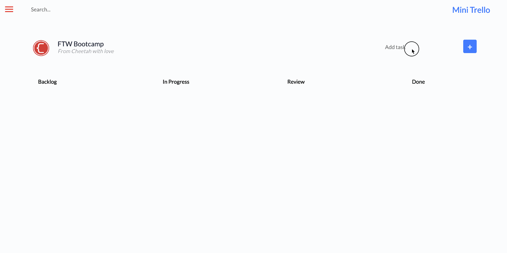
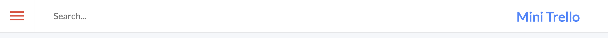
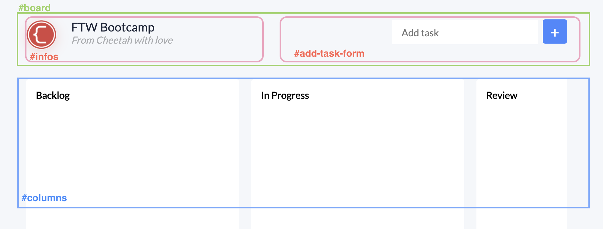
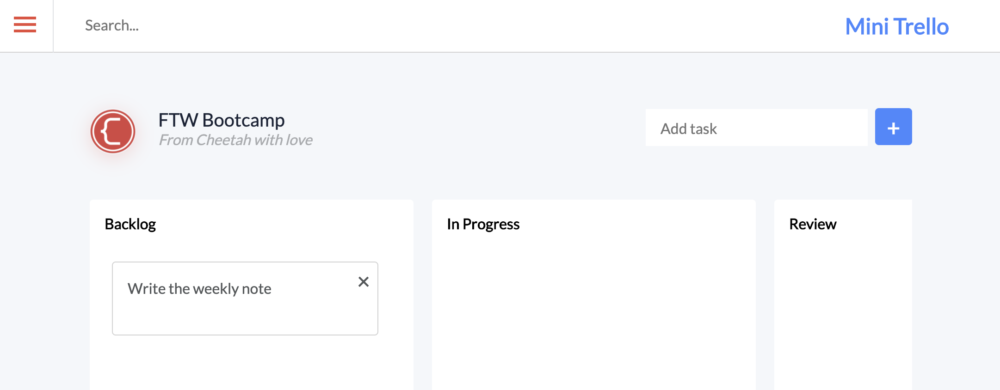

# Lab - Mini Trello



In this lab, you will build a Kanban board. A Kanban board is one of the tools that can be used to implement Kanban to manage work personally or at an organizational level. Kanban boards visually depict work at various stages of a process using cards to represent work items and columns representing each stage of the process. A viral Kanban-styled app is [Trello](https://trello.com/en).

- [Setup project structure](#init-project)
- [Structure the page with HTML](#html)
- [CSS Styles](#style)
- [Adding behavior with Javascript](#javascript)
- [Your turn](#your-turn)

## Implementation

### Setup project structure <a id="init-project"></a>

```
|-mini-trello/
    |- index.html
    |- style.css
    |- script.js
```

- Create 3 empty files like the structure above.

In `index.html`:

- Create the HTML boilerplate structure using the emmet abbreviation `html:5`
- Change `<title>` to "Mini Trello"
- Link to `style.css` using the emmet abbreviation `link:css`
- Link to the javascript file by adding a `<script>` tag at the end of the `<body>` element:

```html
<script type="text/javascript" src="script.js"></script>
```

- Add Google fonts and Font awesome icons: put these `<link>` tags in the `<head>` tag, above your link to `style.css`

```html
<link
  rel="stylesheet"
  href="https://pro.fontawesome.com/releases/v5.10.0/css/all.css"
  integrity="sha384-AYmEC3Yw5cVb3ZcuHtOA93w35dYTsvhLPVnYs9eStHfGJvOvKxVfELGroGkvsg+p"
  crossorigin="anonymous"
/>
<link
  href="https://fonts.googleapis.com/css?family=Lato|Roboto"
  rel="stylesheet"
/>
```

And that's all we need for this mini-project.

### Structure the page with HTML <a id="html"></a>

- In the `<body>`, create a `<header>`, and a `<main id="app">`
- In the `<header>`, create a `<nav id="navbar">`

The navigation bar contains a burger icon, a search input box, and the title "Mini Trello":



- Put this HTML code inside the `<nav id="navbar">`:

```html
<div class="burger">
  <div class="line"></div>
  <div class="line"></div>
  <div class="line"></div>
</div>
<input id="search" placeholder="Search..." autocomplete="off" />
<h1 id="app-title">Mini Trello</h1>
```

In the `<main id="app">`, we'll create 2 `<section>` tags. The first one has `id="board"` and contains logo, descriptiton, and the form to add tasks. The second `<section>` in main contains the columns "Backlog", "In Progress", "Review", and "Done".



- Create `<section id="board">`, and `<section id="columns">` in the `<main id="app">`

- Put this HTML markup in the `<section id="board">`

```html
<div id="infos">
  <div class="logo"></div>
  <div id="infos-content">
    <div class="infos-title">FTW Bootcamp</div>
    <div class="infos-description">From Cheetah with love</div>
  </div>
</div>
<div id="add-task-form">
  <input id="task-value" placeholder="Add task" />
  <button id="add-task">+</button>
</div>
```

- Put this HTML markup in the `<section id="columns">`

```html
<div class="column dropzone">
  <h3 class="column-title">Backlog</h3>
  <ul class="tasks" id="tasks-added">
    <li class="task fill" draggable="true">
      <div class="task-content">Write the weekly note</div>
      <div class="trash">&times;</div>
    </li>
  </ul>
</div>
<div class="column dropzone">
  <h3 class="column-title">In Progress</h3>
  <ul class="tasks"></ul>
</div>
<div class="column dropzone">
  <h3 class="column-title">Review</h3>
  <ul class="tasks"></ul>
</div>
<div class="column dropzone">
  <h3 class="column-title">Done</h3>
  <ul class="tasks"></ul>
</div>
```

We put a mockup task "Write the weekly note" here to design CSS. We'll remove that `<li>` tag.

### CSS Styles <a id="css"></a>

CSS is not the learning goal of this lab. However, I will quickly explain how the layout is structured here:

- The burger icon in the top left corner is made by 3 `<div>` with background color red.
- The `#navbar` is a flex container. The search input inside the `<nav>` has `flex-grow: 1;` to expand as much as it can and push the title "Mini Trello" to the right side.
- The `<section id="board">` is a flex container with property `flex-wrap: wrap;` so that when the page is shrunk, the add new task form will jump to the next row.
- The `<section id="columns">` contains 4 columns and is also a flex container. It has the property `overflow-x: auto;` to add a scroll bar when the content overflows. Each column in this section is not allowed to grow or shrink via `flex: 0 0 auto;` in `.column {..}`
- The tasks are put in an `<ul>` element, and we use the property `list-style-type: none;` to remove the default style of an HTML unordered list.

Put this CSS code below in `style.css`:

```css
:root {
  box-sizing: border-box;
}

*,
::before,
::after {
  box-sizing: inherit;
}

body {
  margin: 0;
  padding: 0;
  background-color: #f5f7fa;
}

header {
  display: flex;
  background-color: white;
  height: 60px;
  border-bottom: solid 1px lightgray;
}
#navbar {
  display: flex;
  align-items: center;
  flex: auto;
}
#navbar .burger {
  padding: 18px 18px;
  border-right: 0.5px solid #e0e2e5;
}
#navbar .burger .line {
  width: 24px;
  height: 3px;
  background-color: #e74c3c;
  margin: 4px 0;
}
#navbar #search {
  flex-grow: 1;
  margin-left: 32px;
  font-family: "Lato";
  font-size: 16px;
  border: none;
}
#navbar #search:focus {
  outline: 0;
}
#navbar #app-title {
  margin-top: 22px;
  margin-right: 60px;
  font-family: "Lato";
  font-style: normal;
  font-weight: bold;
  font-size: 24px;
  line-height: 29px;
  color: #4786ff;
}

#app {
  margin-left: 100px;
  margin-right: 100px;
}
#board {
  margin-top: 60px;
  display: flex;
  flex: auto;
  flex-wrap: wrap;
}
#infos {
  display: flex;
  flex-grow: 1;
  margin-bottom: 5px;
}
#infos img {
  width: 50px;
  height: 50px;
  box-shadow: 0px 4px 20px rgba(231, 76, 60, 0.2);
  border-radius: 50%;
}
#infos #infos-content {
  margin-left: 24px;
}
#infos .infos-title {
  font-family: "Lato";
  font-weight: 500;
  font-size: 20px;
  line-height: 24px;
  color: #1b2437;
}
#infos .infos-description {
  font-family: "Lato";
  font-style: italic;
  font-size: 16px;
  line-height: 19px;
  color: #aaacaf;
}

#add-task-form {
  display: flex;
}
#add-task-form #task-value {
  padding-left: 16px;
  margin-top: 1px;
  height: 40px;
  width: 240px;
  border-radius: 0px;
  margin-right: 8px;
  font-family: "Lato";
  font-size: 16px;
  line-height: 19px;
  border: none;
}
#add-task-form #task-value:focus {
  outline: 0;
  box-shadow: 0px 4px 20px rgba(52, 152, 219, 0.4);
}

#add-task-form #add-task {
  background: #4786ff;
  border: none;
  border-radius: 4px;
  width: 40px;
  height: 40px;
  font-family: Lato;
  font-weight: 900;
  font-size: 24px;
  line-height: 29px;
  color: #ffffff;
}
#add-task-form #add-task:focus {
  outline: 0;
}
#add-task-form #add-task:hover {
  box-shadow: 0px 4px 20px rgba(52, 152, 219, 0.4);
}
#columns {
  margin-top: 40px;
  display: flex;
  overflow-x: auto;
  -webkit-overflow-scrolling: touch;
}
.column {
  flex: 0 0 auto;
  width: 350px;
  height: 520px;
  background: white;
  border-radius: 4px;
  margin-left: 20px;
  background-color: white;
  overflow-y: auto;
  -webkit-overflow-scrolling: touch;
}
.column:first-child {
  margin-left: 0px;
}
.column:hover {
  border: 1px solid #4786ff;
  box-shadow: 0px 4px 20px rgba(52, 152, 219, 0.4);
}
.column-title {
  margin: 16px 0px 0px 16px;
  font-family: "Lato", Arial, Helvetica, sans-serif;
  font-weight: 600;
  font-size: 1em;
}
.tasks {
  padding: 0 24px;
}
.task {
  list-style-type: none;
  margin-top: 10px;
  position: relative;
  background-color: white;
  border: 1px solid lightgrey;
  border-radius: 4px;
  min-height: 80px;
  width: 288px;
}
.task:first-child {
  margin-top: 32px;
}
.task .task-content {
  margin: 16px 16px 0 16px;
  font-family: "Lato";
  font-weight: 400;
  font-size: 16px;
  line-height: 24px;
  color: #54585a;
}
.task:hover {
  background: #ffffff;
  border: 1px solid #4786ff;
  box-sizing: border-box;
  box-shadow: 0px 4px 20px rgba(52, 152, 219, 0.4);
  border-radius: 2px;
}
.task .trash {
  position: absolute;
  top: 5px;
  right: 8px;
  font-family: "Lato";
  font-size: 24px;
  color: #54585a;
}
.task .trash:hover {
  color: #e74c3c;
  cursor: pointer;
}
.hold:active:hover {
  border: solid 3px #4786ff;
}
.hovered {
  border-style: dashed;
}
.invisible {
  display: none;
}
```

- Expected output:



- **Remove or comment out** the mockup `<li class="task fill" draggable="true">` element

```html
<!-- <li class="task fill" draggable="true">
  <div class="task-content">Write the weekly note</div>
  <div class="trash">&times;</div>
</li> -->
```

### Adding behavior with Javascript <a id="javascript"></a>

#### User can add a new task

When user clicks the Add button, we will take three actions:

- Get the content of the `<input id="task-value">`
- If the value is not empty, we'll invoke a function called `addTask(taskValue)` which will add a new `<li>` element in the list Backlog.
- After that, we will remove the text in `<input id="task-value">` to be ready for adding the next task.

Add this code in `script.js`:

```javascript
document.getElementById("add-task").addEventListener("click", function () {
  var taskValue = document.getElementById("task-value").value;
  if (taskValue) alert(taskValue);
  document.getElementById("task-value").value = "";
});
```

- Type something in the "Add task" input and click the Add button. We expect to see an alert window that shows whatever you have typed in.

- Replace `alert(taskValue);` with `addTask(taskValue);` in the `if` statement. Now we work on the `addTask()` function:

```javascript
function addTask(taskValue) {
  var task = document.createElement("li");
  task.classList.add("task");
  task.classList.add("fill");
  task.setAttribute("draggable", "true");
  task.addEventListener("dragstart", dragStart);
  task.addEventListener("dragend", dragEnd);

  var taskContent = document.createElement("div");
  taskContent.classList.add("task-content");
  taskContent.innerText = taskValue;

  var trash = document.createElement("div");
  trash.classList.add("trash");
  trash.innerHTML = "&times;";
  trash.addEventListener("click", removeTask);

  task.appendChild(taskContent);
  task.appendChild(trash);

  var tasks = document.getElementById("tasks-added");
  tasks.insertBefore(task, tasks.childNodes[0]);
}
```

This is basically the code to generate an `<li>` element which contains the task value and a remove button "X". The `<li>` element's structure is the same as the mockup `<li>` element we have removed in the previous step.

There is something new here though:

```javascript
task.addEventListener("dragstart", dragStart);
task.addEventListener("dragend", dragEnd);
// ...
trash.addEventListener("click", removeTask);
```

`dragStart` and `dragEnd` are two event handler functions that we need to add to the `<li>` element to react when user drag and drop the element to another column.

`removeTask` is another event handler that will remove the task if the 'click' event of the "X" button happens.

Implement the event handlers:

```javascript
function removeTask(event) {
  // event represents the remove button
  // Access the <ul> list by moving 2 levels up
  var tasks = event.target.parentNode.parentNode;
  // Access the <li> element which is the direct parent
  var task = event.target.parentNode;
  tasks.removeChild(task);
}

// DRAG & DROP

// A global variable to store the selected task
var task;

function dragStart(event) {
  event.target.className += " hold";
  task = event.target;
  setTimeout(() => (event.target.className = "invisible"), 0);
}

function dragEnd(event) {
  event.target.className = "task fill";
}
```

**Evaluation**

Type something in the Add Task input and click the Add button. You should see the task appears in the Backlog column. You can drag & drop it, but nothing happens for now.

You can click on the remove button to delete the task.

#### User can drag and drop the task to another column

Put this code in `script.js`:

```javascript
function dragEnter(event) {
  event.preventDefault();
  if (event.target.className === "column dropzone") {
    event.target.className += " hovered";
  }
}

function dragOver(event) {
  event.preventDefault();
}

function dragLeave(event) {
  if (event.target.className === "column dropzone hovered") {
    event.target.className = "column dropzone";
  }
}

function dragDrop(event) {
  if (event.target.className === "column dropzone hovered") {
    event.target.className = "column dropzone";
  }
  // event represents the column
  // Add the task to the second element of the column which is the <ul> element (the first one is a <h1>)
  event.target.childNodes[1].append(task);
}

var dropzones = document.querySelectorAll(".dropzone");

for (let index = 0; index < dropzones.length; index++) {
  const dropzone = dropzones[index];
  dropzone.addEventListener("dragenter", dragEnter);
  dropzone.addEventListener("dragover", dragOver);
  dropzone.addEventListener("dragleave", dragLeave);
  dropzone.addEventListener("drop", dragDrop);
}
```

The variable `dropzones` contains all elements that have been assigned to the class `dropzone`. Those elements are actually the columns Backlog, In Progress, Review, and Done.

The `for` loop adds the event handler functions `dragEnter`, `dragOver`, `dragLeave`, `dragDrop` to all columns.

The `dragenter` event is fired when a dragged task enters a column. When the event is fired, we change the column's `border-style` to `dashed` by adding the class `hovered` to the column element.

The `dragover` event is fired when a dragged task is being dragged over a column (every few hundred milliseconds). We don't need this event so we put `event.preventDefault();` in the event handler `dragOver()`.

The `dragleave` event is fired when a dragged task leaves a column. We will remove the class `hovered` to bring the border of the column back to normal.

The `drop` event is fired when a dragged task is dropped on a column. When the event is fired, we add the task element (stored in the variable `task`) to the column's `<ul>` element.

**And that's it. Good job!**

## Your turn <a id="your-turn"></a>

Now it's your turn. Let's implement your own features to the app. Use this list below as suggestions. Feel free to go beyond it:

- Add a Fontawesome icon to replace the "X" of the remove button.
- Make the Add Task input to accept pressing Enter on the keyboard as a confirmation (the same behavior like click the Add button).
- Allow users to edit the task in the column. Hint: add an edit button/icon (similar to the remove button). When user clicks the button, replace the task value text with an input box. After user types something and hit Enter to confirm, remove the input box with the new task value.
- Add buttons/icons that move the task to specific columns automatically.
- And any other awesome ideas that you have.
