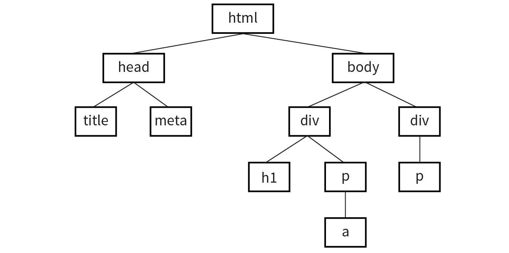
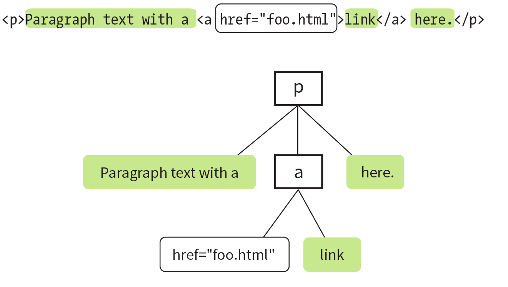

# JavaScript on browsers

In this session, we will learn JS as a way to add interactivity to a page. Whereas the "structural" layer of a page is the HTML markup, and the "presentational" layer of a page is made up of CSS, the third "behavioral" layer is made up of JavaScript.

All of the elements, attributes, and text on a web page can be accessed by scripts using the DOM (Document Objet Model).

## Adding JavaScript to a page

As with CSS, you can embed a script right in a document or keep it in an external file and link it to the page. Both methods use the `script` element.

**Embedded Script**: just add the code as the content of a `<script>` element:

```html
<script type="text/javascript> ...JS code goes here... </script>
```

**External Scripts**: uses the `src` attribute of the `<script>` element to point to a script file:

```html
<script src="my_script.js"></script>
```

As with CSS, we prefer external scripts.

**Script placement**: For most scripts, the end of the document, just before the `</body>` tag, is the prefered placement because the browser will be done parsing the document and its DOM structure.

## Document Object Model (DOM)

The DOM connects web pages to programming languages by representing the structure of a document. **The DOM gives us a way to access and manipulate the contents of a document.**

The DOM represents a document with a logical tree. Each branch of the tree ends in a node, and each node contains objects. DOM methods allow programmatic access to the tree. With them, you can change the document's structure, style, or content.

Nodes can also have event handlers attached to them. Once an event is triggered, the event handlers get executed.

**The Node Tree**:

```html
<!DOCTYPE html>
<html>
  <head>
    <title>Document title</title>
    <meta charset="utf-8" />
  </head>
  <body>
    <div>
      <h1>Heading</h1>
      <p>Paragraph text with a <a href="foo.html">link</a> here.</p>
    </div>
    <div><p>More text here.</p></div>
  </body>
</html>
```



The nodes within the first `<p>` element:



### Accessing DOM Nodes

Methods for accessing nodes in the document:

#### `getElementsByTagName()`

```javascript
var paragraphs = document.getElementsByTagName("p");
```

Then `paragraphs` is a collection of nodes or node list. `paragraphs[0]` is a reference to the first paragraph in the document, `paragraphs[1]` refers to the second, and so on.

#### `getElementById()`

```html

```

```javascript
var photo = document.getElementById("cat-photo");
```

This method returns a single element based on that element’s ID.

#### getElementsByClassName()

```javascript
var firstColumn = document.getElementsByClassName("column-a");
```

Like `getElementsByTagName()`, this returns a node list that we can reference by index or loop through one at a time.

#### querySelectorAll()

`querySelectorAll()` allows you to access nodes of the DOM based on a CSS-style selector.

```javascript
var sidebarPara = document.querySelectorAll(".sidebar p");
var textInput = document.querySelectorAll("input[type='text']");
```

`querySelectorAll()` returns a nodeList, even if the selector matches only a single element.

### Accessing an attribute value

To get the value of an attribute attached to an element node, we call **`getAttribute()`** with a single argument: the attribute name.

```html

```

```javascript
var catImage = document.getElementById("cat-photo");
alert(catImage.getAttribute("src")); // Alerts "photo.jpg".
```

### Manipulating Nodes

Once we’ve accessed a node by using one of the methods discussed previously, the DOM gives us several built-in methods for manipulating those elements, their attributes, and their contents.

#### `setAttribute()`

```javascript
var catImage = document.getElementById("cat-photo");
catImage.setAttribute("src", "another_cat.jpg");
```

This method requires two arguments: the attribute to be changed and the new value for that attribute.

#### `innerHTML`

`innerHTML` gives us a simple method for accessing and changing the text and markup inside an element.

```javascript
var introDiv = document.getElementsByClassName("intro");
introDiv[0].innerHTML = "<p>This is our intro text</p>";
```

#### style

The DOM also allows you to add, modify, or remove a CSS style from an element by using the style property.

```javascript
document.getElementById("intro").style.color = "#fff";
document.getElementById("intro").style.backgroundColor = "#f58220";
```

In JavaScript and the DOM, property names that are hyphenated in CSS (such as `background-color` and `border-top-width`) become camel case (`backgroundColor` and `borderTopWidth`, respectively).

### Addings and removing elements

The DOM also allows developers to change the document structure itself by adding and removing nodes on the fly.

#### `createElement()`

```javascript
var newDiv = document.createElement("div");
```

This function accepts a single argument: the element to be created. Once we create an element in this way, that new element remains floating in the JavaScript ether until we add it to the document. Think of it as creating a reference to a new element that lives purely in memory

#### `createTextNode()`

If we want to enter text into either an element we’ve created or an existing element on the page, we can call the createTextNode() method. This creates a reference to the new text node that we can store in a variable and add to the page when the time comes.

```javascript
var ourText = document.createTextNode("This is our text.");
```

#### `appendChild()`

This method takes a single argument: the node you want to add to the DOM. You call it on the existing element that will be its parent in the document structure.

```html
<div id="our-div"></div>
```

```javascript
var ourDiv = document.getElementById("our-div");
var newParagraph = document.createElement("p");
var copy = document.createTextNode("Hello, world!");

newParagraph.appendChild(copy);
ourDiv.appendChild(newParagraph);
```

#### `insertBefore()`

The insertBefore() method, as you might guess, inserts an element before another element. It takes two arguments: the first is the node that gets inserted, and the second is the element it gets inserted in front of. You also need to know the parent to which the element will be added.

```html
<div id="our-div">
  <p id="our-paragraph">Our paragraph text</p>
</div>
```

```javascript
var ourDiv = document.getElementById("our-div");
var para = document.getElementById("our-paragraph");
var newHeading = document.createElement("h1");
var headingText = document.createTextNode("A new heading");
newHeading.appendChild(headingText); // Add our new text node to the new heading

ourDiv.insertBefore(newHeading, para);
```

#### `replaceChild()`

The `replaceChild()` method replaces one node with another and takes two arguments. The first argument is the new child (i.e., the node you want to end up with). The second is the node that gets replaced by the first. As with `insertBefore()`, you also need to identify the parent element in which the swap happens.

```html
<div id="our-div"><div id="swap-me"></div></div>
```

```javascript
var ourDiv = document.getElementById("our-div");
var swapMe = document.getElementById("swap-me");

// Create a new image element
var newImg = document.createElement("img");
// Give the new image a "src" attribute
ourDiv.replaceChild(newImg, swapMe);
newImg.setAttribute("src", "path/to/image.jpg");
```

#### `removeChild()`

You remove a node or an entire branch from the document tree with the `removeChild()` method. The method takes one argument, which is the node you want to remove. Remember that the DOM thinks in terms of nodes, not just elements, so the child of an element may be the text (node) it contains, not just other elements.

The method is always called on the parent element of the element to be removed (hence, “remove child”).

```html
<div id="parent">
  <div id="remove-me">
    <p>I never liked it here anyway.</p>
  </div>
</div>
```

```javascript
var parentDiv = document.getElementById("parent");
var removeMe = document.getElementById("remove-me");
// Removes the div with the id "remove-me" from the page.
parentDiv.removeChild(removeMe);
```

## Events

An event is an action that can be detected with JavaScript, such as when user clicks an element or just moves the mouse over it. There are 3 ways to register event handlers for a DOM element.

- As an HTML attribute

```html
<button onclick="alert('Hello world!')"></button>
```

- As a method attached to the element

```javascript
myButton.onclick = function (event) {
  alert("Hello world");
};
```

- Using [addEventListener()](https://developer.mozilla.org/en-US/docs/Web/API/EventTarget/addEventListener)

```javascript
// Assuming myButton is a button element
myButton.addEventListener("click", greet);
function greet(event) {
  // print and have a look at the event object
  console.log("greet:", event);
  alert("hello world");
}
```

**Commons events**

| Event handler | Event description                                  |
| :------------ | :------------------------------------------------- |
| onblur        | An element loses focus.                            |
| onchange      | The content of a form field changes.               |
| onclick       | The mouse clicks an object.                        |
| onerror       | An error occurs when the document or an image load |
| onfocus       | An element gets focus.                             |
| onkeydown     | A key on the keyboard is pressed.                  |
| onkeypress    | A key on the keyboard is pressed or held down      |
| onkeyup       | A key on the keyboard is released.                 |
| onload        | A page or an image is finished loading.            |
| onmousedown   | A mouse button is pressed.                         |
| onmousemove   | The mouse is moved.                                |
| onmouseout    | The mouse is moved off an element.                 |
| onmouseover   | The mouse is moved over an element.                |
| onmouseup     | A mouse button is released.                        |
| onsubmit      | The submit button is clicked in a form.            |
