# Environment Setup


## Visual studio code 
 Visual Studio Code is a **free source-code editor** made by Microsoft for Windows, Linux and macOS. Features include support for debugging, syntax highlighting, intelligent code completion, snippets, code refactoring, and embedded Git.
1.  Download the Visual studio code from this webiste
https://code.visualstudio.com/
2.  Once it is downloaded, run the installer (VSCodeUserSetup-{version}.exe). This will only take a minute.
3.  By default, VS Code is installed under C:\users\{username}\AppData\Local\Programs\Microsoft VS Code.

### code command setup 
you will use `code` command at the terminal to open visual studio code. For that, you need to install the `code` command 
1. Open Visual studio code
2. Press `Ctrl`+`Shift`+`p` or for Mac user `cmd`+`shift`+`p`
3. You will see the input block from the top. and type the `shell`
4. click the _shell command install 'code' command in path command_ option
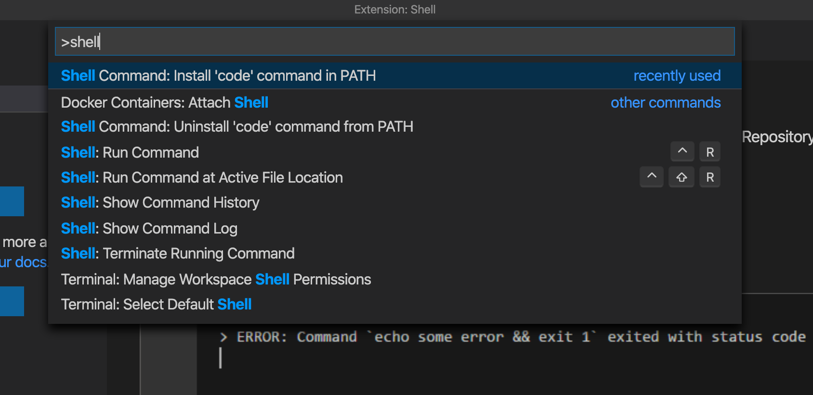
5. All set! Test open the visual studio from code command at terminal 
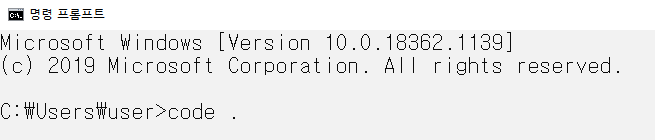

### Extention Setup
Amazing thing about Visual Studio code is that you can download the extention packpage to develop easier 
There are couple extension we recommand you to download 

1. Click the extention
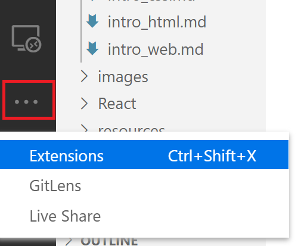

2. Download the extentions in this picture below(you can search from search bar)
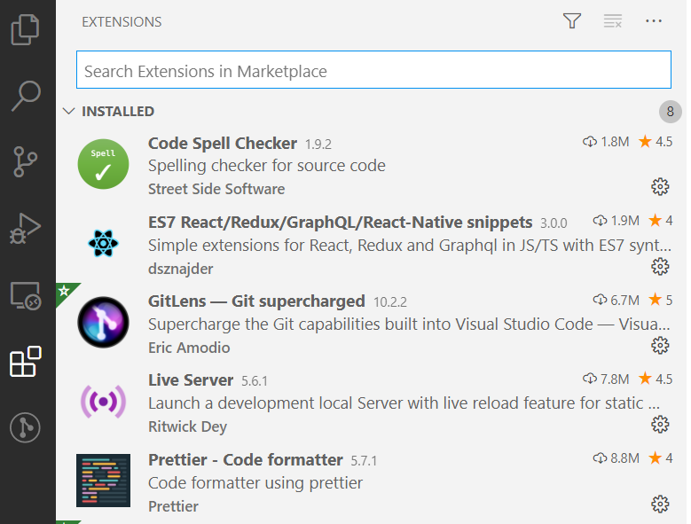

## Github 
Git is a distributed version-control system for tracking changes in source code during software development. It is designed for coordinating work among programmers, 

1. Visit [GitHub](https://github.com/) to create an account.

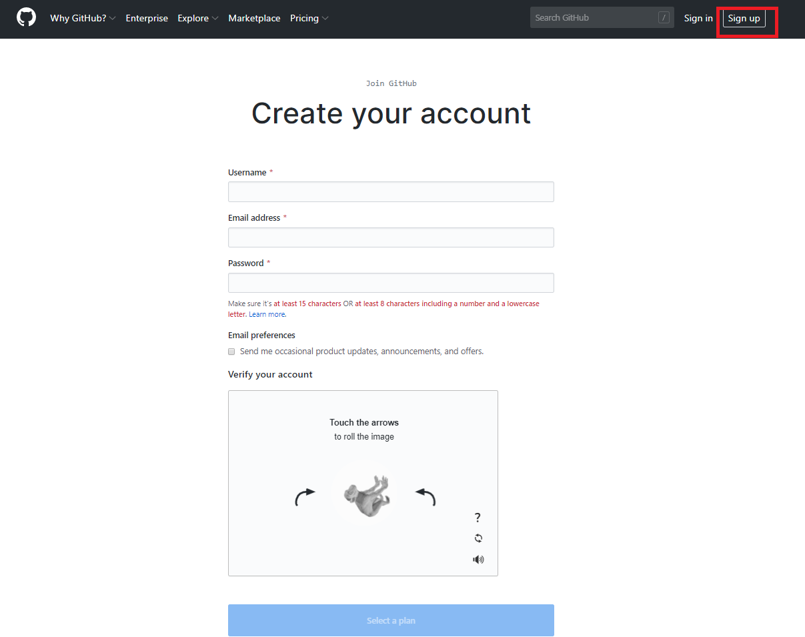

Help them help you


After verify your email, you are able to make the first repository in your github 

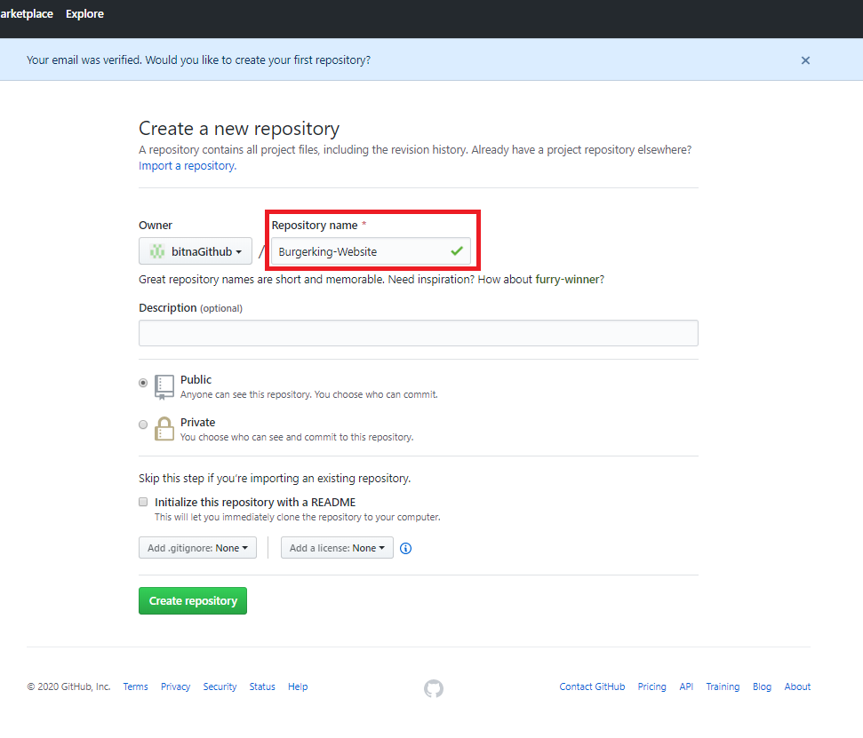

Fill up the repository name and click the `Create repository` 

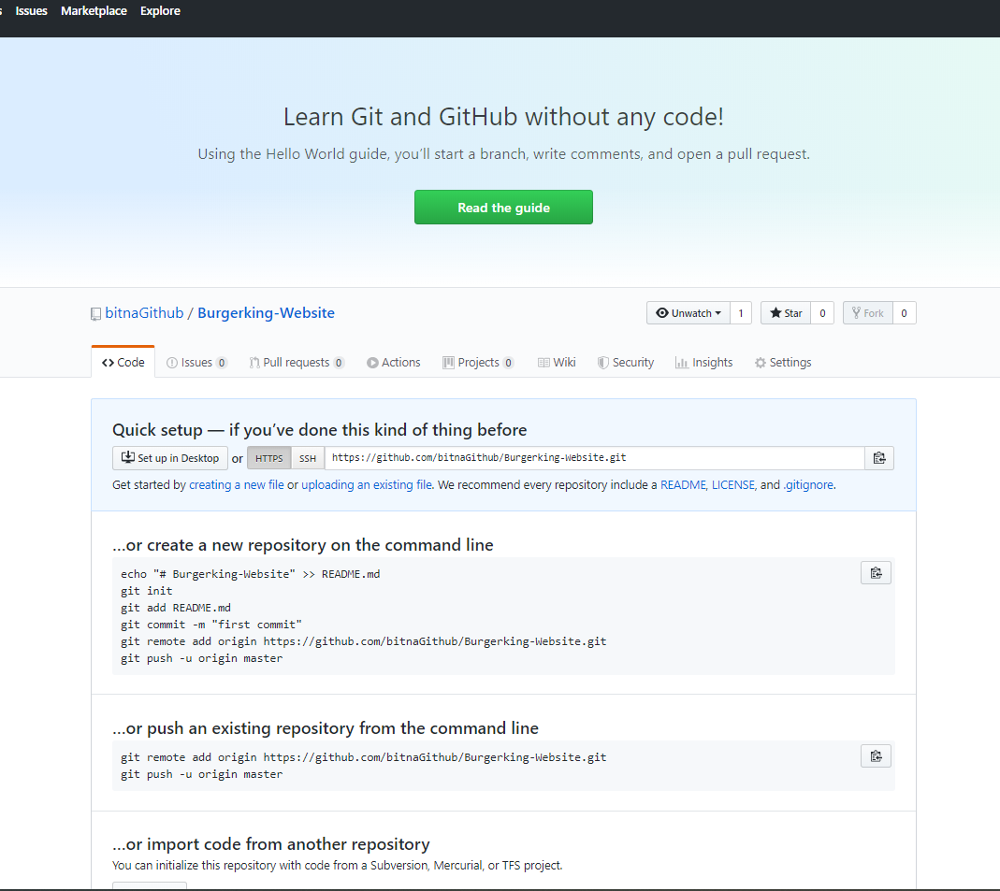

If you get to this page. Now you got your first empty repository

2. Install the Git 
To publish your code to Github, you need to download the github 
[Download Git from this link](https://git-scm.com/downloads)
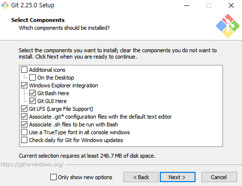
You don't need to change any setting. Keep click the 'Next' button to finish to download.

3. Set useful global Git config

After download Git, you need to config your Gitbash only one time when you just download the git. 
open the Gitbash and type some commands step by step 

* Step 1: username to using for git commit
```
git config --global user.name "your_name"
```
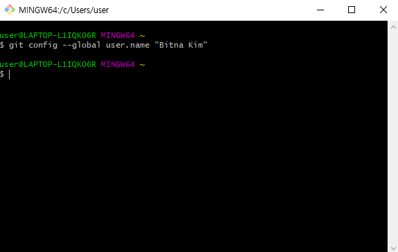

* Step 2: email to use for git commit
```
git config --global user.email "your_email"
```
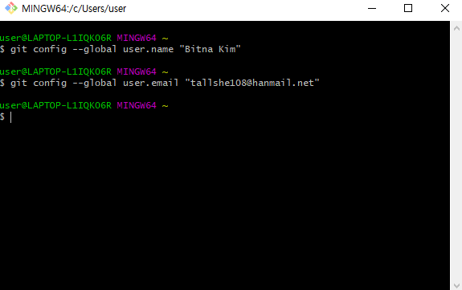

* Step 3: check your setting information
```
git config --list
```
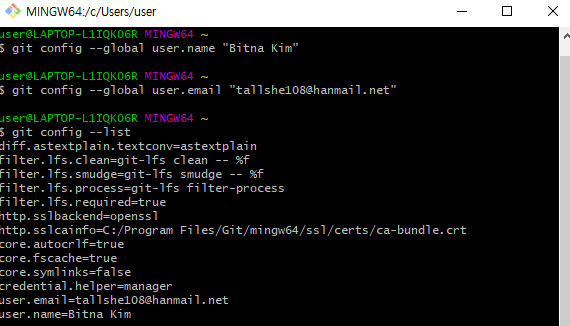

Now you all set!

4. Test Git Command
Now we are so ready to publish your code to Github! There are useful Github commands to publish your code. It's good to remember these.
* Step 1: Open your project at VScode. and click the new terminal at the top menu 
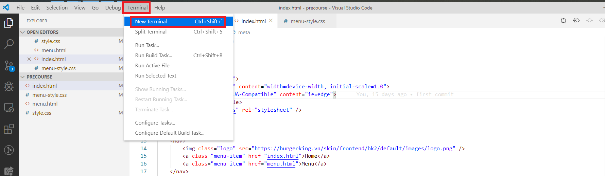
Now you can see the terminal at the bottom

* Step 2: Initialize Git to your project
```
git init
```
if you see the message in the picture below. you are successfully set up the git into your proejct
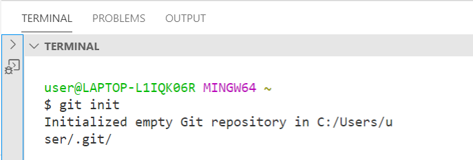

## NodeJS

1. Go to the site https://nodejs.org/en/download/ and download the necessary binary files. In our example, we are going to download the 32-bit setup files for Node.js.

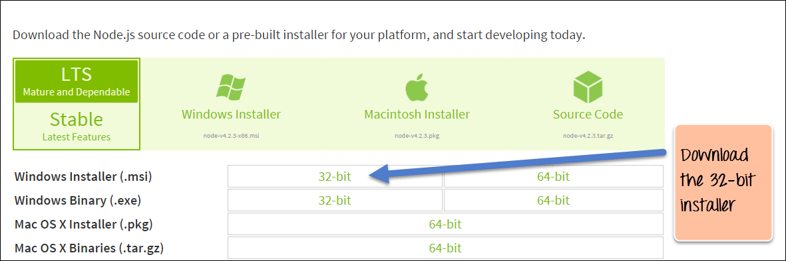

2. Double click on the downloaded .msi file to start the installation. Click the Run button on the first screen to begin the installation.


3. In the next screen, click the "Next" button to continue with the installation


4. In the next screen, Accept the license agreement and click on the Next button.
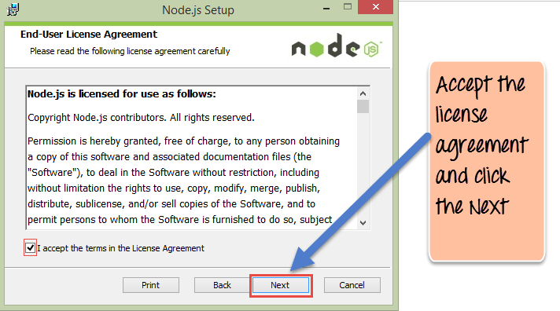

5. In the next screen, choose the location where Node.js needs to be installed and then click on the Next button.

    a. First, enter the file location for the installation of Node.js. This is where the files for Node.js will be stored after the installation.

    b.  Click on the Next button to proceed ahead with the installation.


6. Accept the default components and click on the Next button.

7. In the next screen, click the Install button to start the installation.
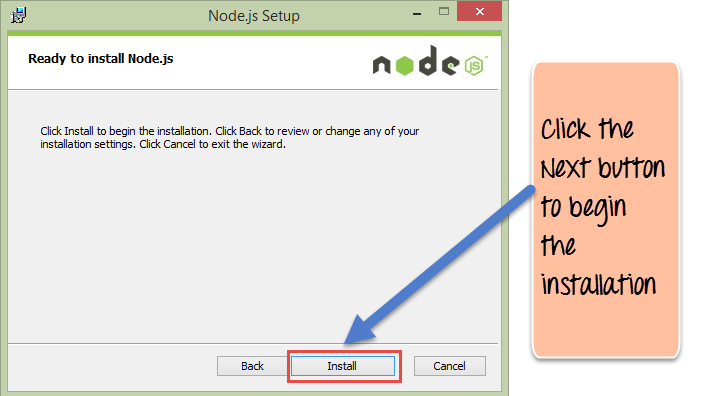
8. Click the Finish button to complete the installation.
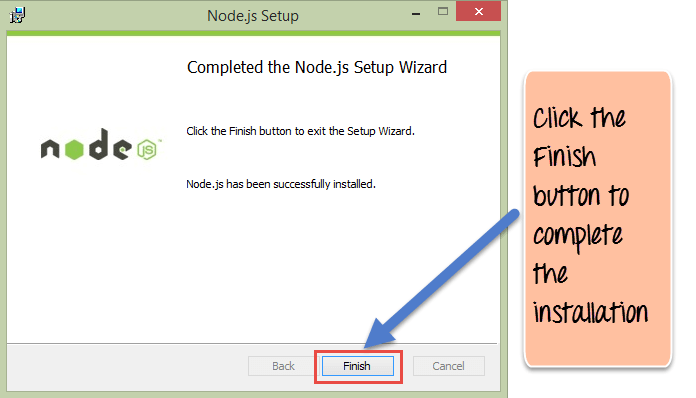


## MongoDB
For Window User, follow this link
https://docs.mongodb.com/manual/tutorial/install-mongodb-on-windows/

For Mac user, follow this link
https://docs.mongodb.com/manual/tutorial/install-mongodb-on-os-x/

Also you need to downlaod **MongoDB compass** to see your Database data easily 
Follow this link 
https://docs.mongodb.com/compass/master/install
