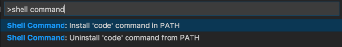
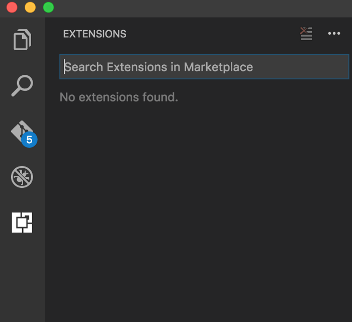
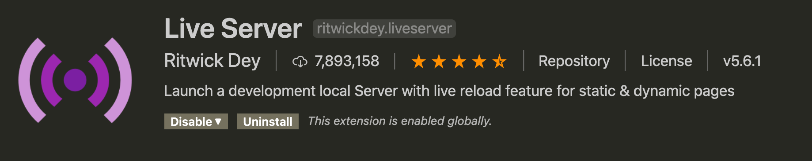
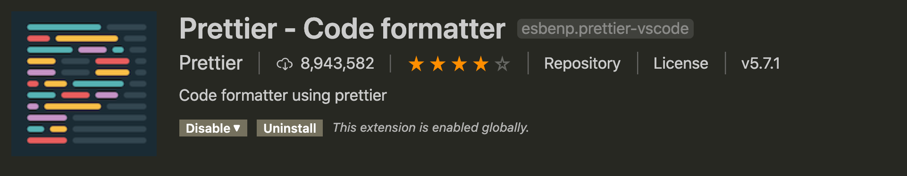
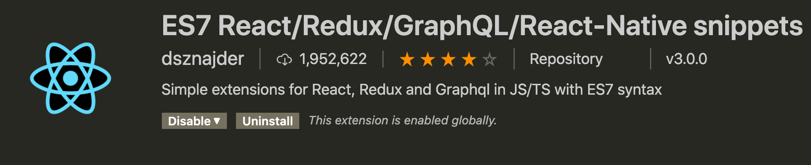
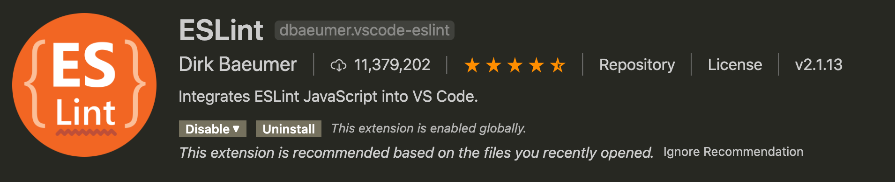
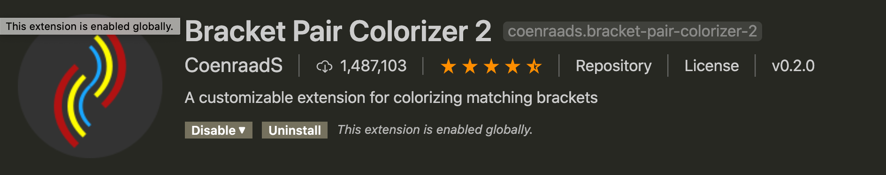
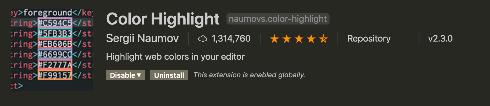
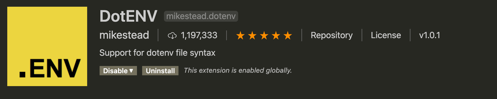

# Setup Local Development Environment

## What will you need

- **Chrome** as the browser. You can install it from [here](https://www.google.com/chrome/). Chrome includes a set of developers tools that will come in handy down the road.

- **Visual Studio Code (VS Code)** as the code editor. Follow this [setup instruction](https://code.visualstudio.com/docs/setup/setup-overview). Pick the guide that matches with your operating system.

  Open VS Code and access the Command Palette (Ctrl/Cmd + Shift + P) and start typing `shell command` and select option `Shell Command: Install 'code' command in PATH`

  

- **Git and Github** for version control and repository hosting service. Getting started [here](https://git-scm.com/book/en/v2/Getting-Started-Installing-Git).

- **NodeJS** as the Javascript run-time environment. Go to the [Node home page](http://nodejs.org/). Click the big green button that has a version number followed by “LTS (Recommended for Most Users).”

- Using the Terminal (also called a console or command prompt). If you’re not friends with your terminal, I highly recommend you spend some time familiarizing yourself with your terminal of choice. If you’re on macOS or Linux, you already have it. For Windows user, Git helpfully includes a "Git Bash" shell, which provides a Unix-like terminal experience.

### Testing your environment

Open a Terminal:

- Test that `nodejs` is installed: run the "version" command

```
$ node -v
v12.19.0
```

- The Nodejs package manager NPM should also have been installed, and can be tested in the same way:

```
$ npm -v
6.14.6
```

- The version command in `git` is slightly different:

```
$ git --version
git version 2.24.3
```

- Run this command to open the **current directory** in Visual Studio Code

```
$ code .
```

## VS Code Extensions

Extensions are an easy way to extend the out-of-the-box functionality of Visual Studio Code. You can browse and install VS Code extensions from the Extensions view in the Side Bar. To open that view just click on the Extension Icon in the Activity Bar on the left. The following view will open:



In the extensions view you can search for extensions. The list of results is presented in the Side Bar area. You can select an extension from the list and the extensions’s details page is presented on the right side.

These are the list of extensions that will be useful:

- **Live Server**: Launch a development local Server with live reload feature for static & dynamic pages.



- **Prettier**: to prettify your code.



- **ES7 React/Redux/GraphQL/React-Native snippets**: This extension provides you JavaScript and React/Redux snippets in ES7 with Babel plugin features for VS Code.



- **ESLint**: Integrates ESLint JavaScript into VS Code.



- **Bracket Pair Colorizer 2**: A customizable extension for colorizing matching brackets.



- **Color Highlight**: Highlight web colors in your editor.



- **DotENV**: Support for dotenv file syntax.


